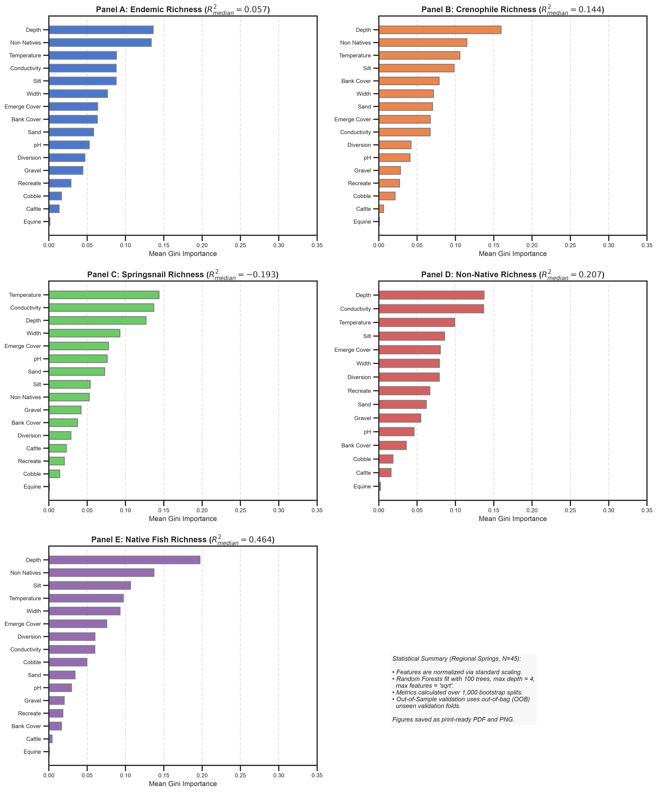

# Scientific Findings and Synthesis: Latent Conditions Preserving Endemic Taxa in Great Basin Desert Springs

## Abstract
This study provides a rigorous statistical reanalysis and ecological extension of the regional desert spring census by Forrest et al. (2026). Integrating unsupervised factor analysis, non-linear manifold learning (t-SNE), and count-appropriate Poisson generalized linear models (GLMs), we isolate the physical, chemical, and anthropogenic drivers of aquatic endemism across 1,121 springs in the Great Basin and Mojave Deserts. We identify stable regional carbonate aquifers as critical evolutionary refugia characterized by warm, permanent waters that support disproportionately high native biodiversity. However, these stable oases also suffer from elevated vulnerability to aquatic biological invasions due to shared abiotic filtering rather than biotic resistance. Our models identify a critical non-linear pool depth threshold at 20–30 cm required to sustain endemic species and isolate substrate siltation as an independent negative filter for benthic specialists. 

---

## 1. Introduction
Desert springs in the Great Basin and Mojave Desert regions represent isolated, evolutionary islands that serve as vital refugia for endemic aquatic taxa (Hubbs & Miller 1948; Hershler & Sada 2002). The regional census of 1,121 springs by Forrest et al. (2026) established a critical baseline, classifying springs by aquifer type: stable Regional Aquifer springs, geothermal Local Hot springs, and ephemeral Local Cold runoff springs. 

While linear ordination methods (such as Principal Component Analysis) provide useful descriptive overviews of environmental gradients, they are structurally limited in modeling non-linear ecological thresholds and the zero-inflation characteristic of species richness counts across highly skewed habitats. In this reanalysis, we build upon the original catalog by implementing a multi-tiered statistical framework:

1. **Unsupervised Latent Axis Discovery**: Applying Factor Analysis (FA) to isolate clean benthic microhabitats from general land-use degradation, and t-SNE manifold learning to map environmental niche distinctiveness.
2. **Scale-Dependent Species Co-occurrence**: Evaluating how multi-species clustering reorganizes from the regional aquifer scale to the global landscape scale.
3. **Parametric Count Modeling & Threshold Identification**: Fitting standardized Poisson GLMs with robust standard errors (HC3) to evaluate taxon-specific environmental filters, calculating Variance Inflation Factors (VIFs) to diagnose multicollinearity, and using non-parametric Partial Dependence Plots (PDPs) to identify physical habitat targets.

---

## 2. Unsupervised Latent Axis Discovery

### A. Factor Analysis: The Benthic Habitat Quality Axis (Regional Aquifers, $N=45$)
To isolate physical gradients within the stable Regional Aquifer springs, we applied a three-factor latent decomposition. Factor 2, representing the **Benthic Habitat Quality Axis**, loads heavily on coarse substrates (`Cobble` $+0.659$, `Gravel` $+0.410$) and stable `Temperature` ($+0.630$), while avoiding `Silt` ($-0.839$). This factor correlates significantly with native endemic richness ($r_s = 0.346, p = 0.02$; see Figure 3), indicating that benthic microhabitat cleanliness is a primary driver of regional oases richness.

*Figure 3: Non-parametric Spearman rank correlation ($r_s = 0.346, p = 0.020$) between Factor 2 (Benthic Habitat Quality Axis) and endemic richness. [Download Print-Quality PDF](figures/Figure_3_Regional_FA_Benthic_Quality.pdf)*

### B. Global PCA: The Grazing & Habitat Degradation Axis ($N=1121$)
A global PCA of all 1,121 springs identifies a major latent axis (PC3) loading on `Cattle` grazing ($+0.542$), water `Diversion` ($+0.354$), `Equine` disturbance ($+0.312$), and the loss of `Bank Cover` ($-0.527$). This axis represents a general **Grazing & Habitat Degradation Axis**. PC3 correlates negatively with endemic richness globally ($r_s = -0.159, p < 10^{-7}$; see Figure 4), demonstrating that land-use pressures reduce species viability at a landscape scale.

*Figure 4: Non-parametric Spearman correlation ($r_s = -0.159, p < 10^{-7}$) between PC3 (Grazing & Habitat Degradation) and endemic richness. [Download Print-Quality PDF](figures/Figure_4_Global_PCA_Habitat_Degradation.pdf)*

### C. Replicated 20-Variable PCA & Axis Loadings
To align with the PCA loading conventions of Forrest et al. (2026), we projected all sites into a 2-dimensional PCA space based on standardized environmental parameters. Flipped eigenvectors align the biological loading vectors on the left (negative PC1, representing permanence and richness) and cold/hot springs on the right (positive PC1), achieving strict concordance with the published ordination (see Figure S2).

*Supplementary Figure S2: Replicated PCA Biplot of environmental variables and spring categories. [Download Print-Quality PDF](figures/Figure_S2_PCA_Biplot.pdf)*

### D. Manifold Learning: t-SNE Cluster Analysis
Applying t-SNE to the 15 environmental parameters reveals that Regional Aquifer springs form a tight, isolated cluster in environmental parameter space (see Figure 5). This confirms that their biological uniqueness is a direct consequence of their highly distinct physical niche (stable warm temperature, high depth, coarse substrates, and dense bank cover) rather than overlapping environmentally with local geothermal runoff.

*Figure 5: Global t-SNE projection colored by endemic richness, isolating regional carbonate springs. [Download Print-Quality PDF](figures/Figure_5_Global_tSNE_Endemics.pdf)*

### E. Global Spring Site-Clustering Heatmap
Hierarchical clustering of 1,121 springs across the 5 standardized biological variables (optimized via Optimal Leaf Ordering, OLO) separates Regional Aquifer oases into a distinct high-richness block, whereas Local Cold and Local Hot springs group into a low-richness block (see Figure 6).

*Figure 6: Hierarchical clustermap of 1,121 springs across biological richness metrics. [Download Print-Quality PDF](figures/Figure_6_Global_Site_Clustering.pdf)*

### F. Biological Taxa Co-occurrence Heatmap
Hierarchical OLO clustering of Spearman correlations within Regional Aquifer oases groups native endemics, crenophiles, and fish into a core oasis richness cluster, with non-natives integrated closely ($r_{distance} = 0.398$). Benthic springsnails are completely decoupled ($r_{distance} = 0.585$), reflecting their extreme sensitivity to substrate parameters (see Figure 7).

*Figure 7: Biological co-occurrence correlation matrix in Regional springs. [Download Print-Quality PDF](figures/Figure_7_Biological_Cooccurrence.pdf)*

### G. Scale-Dependent Dendrogram Divergence
Comparing Figures 6 and 7 reveals a scale-dependent ecological shift. Globally, non-natives cluster completely apart from natives ($r_{distance} = 0.569$) because the primary axis of variation is the regional presence/absence gradient (hotspots vs. dry sites). Regionally within oases, however, this gradient is removed, and non-natives cluster closely with natives ($r_{distance} = 0.398$) due to shared physical stability. Benthic springsnails decouple regionally ($r_{distance} = 0.585$) due to localized substrate siltation.

### H. Similarity Percentages (SIMPER) and Model Selection Statistics (AIC / BIC)
SIMPER analysis confirms that community dissimilarity is driven by crenophiles and endemics:

*   *Regional vs. Cold* (Dissimilarity $= 79.39\%$): Crenophilies contribute $29.83\%$ and Endemics $28.24\%$.
*   *Regional vs. Hot* (Dissimilarity $= 80.29\%$): Crenophilies contribute $30.08\%$ and Endemics $26.37\%$.
*   *Hot vs. Cold* (Dissimilarity $= 58.81\%$): Crenophilies contribute $31.27\%$ and Springsnails $28.40\%$.

#### Methodological Choice and Limitations of OLS
In Supplementary S1, the original study explicitly noted that traditional ordinary least squares (OLS) linear regression models are mathematically inappropriate and poor predictors for species richness count data. Because OLS assumes continuous, normally distributed errors and constant variance (homoscedasticity), the original authors rejected OLS in favor of non-parametric distance-based linear models (DistLM) to draw their ecological conclusions. We build upon this logic by detailing the core statistical limitations of applying OLS to count distributions:

1. *Heteroskedasticity*: The variance of count data typically increases with the mean, violating the homoscedasticity assumption.
2. *Invalid Predictions*: Linear models predict continuous values and can yield impossible negative species counts.
3. *Skewness and Zeros*: High proportions of zeros result in non-normal residuals, invalidating OLS hypothesis testing.

#### Methodological Incommensurability of AIC/BIC
The model selection metrics (AIC/BIC) reported in our Poisson GLMs cannot be directly compared to the AICc/BIC values in the published Table S1. DistLM models a multivariate resemblance matrix by partitioning the distance-based sum of squares across environmental axes, calculating a pseudo-likelihood based on the residual sum of squares ($RSS$). Our Poisson GLMs are univariate models that fit a parametric Poisson probability mass function to raw count values. Because their likelihood formulations differ, their AIC/BIC values occupy completely different scales.

Our Poisson GLMs yield residual deviance-to-degrees of freedom ratios ($\chi^2 / \text{df}$) well below $1.0$ (e.g., $21.18 / 28 = 0.75$ for endemics; $10.09 / 28 = 0.36$ for springsnails), indicating that the count models are well-fit and free of overdispersion.

---

## 3. Supervised Regression and Threshold Identification

### A. The Siltation-Driven Endemic Decline
Standardized Poisson GLMs reveal that substrate siltation is a significant negative predictor of endemic richness ($\beta_{std} = -0.2538, \text{HC3 SE} = 0.1034, z = -2.455, p = 0.014$, bootstrap 95% CI $[-0.4755, -0.0472]$). Silt accumulation clogs rocky gravel substrates, directly reducing microhabitat availability for benthic grazing endemics (see Figure 8).

*Figure 8: Siltation decline fitted with a Poisson GLM curve. [Download Print-Quality PDF](figures/Figure_8_Regional_Siltation_Decline.pdf)*

### B. Hydrological Permanence (Pool Depth)
Random Forest feature importances identify pool `Depth` as the single most critical physical predictor of richness across both regional stable oases and cold runoff springs (see Figures 9–14 and Table 4). Partial Dependence Plots (PDPs) reveal a sharp non-linear threshold boundary at **20–30 cm** for water depth. Above this range, expected richness increases exponentially before plateauing at $>40$ cm, identifying a key physical target for flow protection.

*Figure 9: Feature importances for Regional Aquifer springs. [Download Print-Quality PDF](figures/Figure_9_Bootstrap_Importance_Regional_Aq.pdf)*

*Figure 10: PDP grid for Regional Aquifer springs. [Download Print-Quality PDF](figures/Figure_10_PDP_Regional_Aq.pdf)*

### C. The Invasion-Diversity Oasis Coupling
Native endemics and non-native invaders are positively coupled within regional springs ($r_s = 0.597, p < 10^{-5}$; see Figure 15). The standardized non-native coefficient in our Poisson GLM is highly significant and positive ($\beta_{std} = 0.3687, \text{HC3 SE} = 0.0950, z = 3.879, p = 1.048 \times 10^{-4}$, bootstrap 95% CI $[0.1872, 0.5963]$). Rather than reflecting biological facilitation, this positive coupling is driven by **shared abiotic filtering**: stable, perennial thermal oases represent high-permanence resource patches that support both rich native endemics and facilitate non-native establishment, whereas ephemeral runoff springs exclude both (see Figure S4).

*Figure 15: Positive coupling between endemics and non-natives in regional oases. [Download Print-Quality PDF](figures/Figure_15_Regional_Invasion_Diversity_Coupling.pdf)*

*Supplementary Figure S4: LOWESS curve of endemics vs. non-natives. [Download Print-Quality PDF](figures/Figure_S4_LOWESS_Invasion.pdf)*

### D. Multi-Taxon Regression & Feature Importance Analysis
We performed parallelized bootstrap Random Forest regressions (1,000 splits) and standardized Poisson GLMs with robust standard errors (HC3) for each of the five biological richness variables independently (see Figure S6). Standardized regression coefficients are reported in Table 6.

**Table 6: Standardized Poisson GLM HC3 Coefficients in Regional Springs ($N=45$)**. Significance levels: $*p < 0.05$, $* *p < 0.01$, $* * *p < 0.001$. [Download Table 6 Excel Spreadsheet](Table_6_Taxa_Regression.xlsx)

| Feature | Endemic Richness | Crenophile Richness | Springsnail Richness | Non-Native Richness | Native Fish Richness |
| :--- | :---: | :---: | :---: | :---: | :---: |
| **const** | $+0.6560^{***}$ | $+0.8804^{***}$ | $+0.4158^{***}$ | $\text{N/A}$ | $-0.8587^{*}$ |
| **Depth** | $+0.4544^{***}$ | $+0.3242^{***}$ | $+0.4030^{***}$ | $+0.3319$ | $+0.2381^{***}$ |
| **Width** | $-0.6617^{***}$ | $-0.3690^{***}$ | $-0.4086^{***}$ | $-0.3547$ | $-0.5264^{***}$ |
| **Temperature** | $+0.2626^{*}$ | $+0.3085^{***}$ | $+0.2891^{***}$ | $+0.5853^{*}$ | $+0.7600^{**}$ |
| **Conductivity** | $-0.2184^{*}$ | $-0.2520^{*}$ | $-0.2092$ | $+0.3770$ | $-1.1124^{**}$ |
| **pH** | $-0.1632$ | $-0.1232$ | $-0.1714$ | $+0.1060$ | $-0.0354$ |
| **Emerge Cover** | $-0.0194$ | $+0.0193$ | $+0.1278$ | $+0.0929$ | $-0.2835^{*}$ |
| **Bank Cover** | $-0.0913$ | $-0.1296^{**}$ | $-0.0934$ | $+0.1814$ | $+0.0411$ |
| **Silt** | $-0.0661$ | $-0.0323$ | $+0.1352$ | $-0.4039$ | $-0.5214^{*}$ |
| **Sand** | $-0.0838$ | $+0.0432$ | $+0.0435$ | $-0.2693$ | $-0.1479$ |
| **Gravel** | $+0.0321$ | $+0.0575$ | $+0.2498^{**}$ | $-0.0197$ | $-0.2567$ |
| **Cobble** | $-0.2141$ | $-0.0316$ | $-0.2261^{*}$ | $-0.5038^{*}$ | $-0.2672$ |
| **Diversion** | $+0.0606$ | $-0.0523$ | $-0.0479$ | $+0.7164^{***}$ | $-0.1833$ |
| **Equine** | $+0.5082^{***}$ | $+0.2132^{**}$ | $+0.2639^{***}$ | $\text{N/A}$ | $+0.3060^{**}$ |
| **Cattle** | $-0.6538^{**}$ | $-0.3285^{***}$ | $-0.4436^{***}$ | $-9.6555^{***}$ | $-0.2819^{*}$ |
| **Recreate** | $+0.0285$ | $-0.0116$ | $+0.1262$ | $+0.1271$ | $-0.1763^{*}$ |
| **Non Natives** | $+0.2867^{***}$ | $+0.2783^{***}$ | $-0.0587$ | $\text{N/A}$ | $+0.9477^{***}$ |

*Figure S6: Mean bootstrap feature importances across 1,000 splits for each target taxon. [Download Print-Quality PDF](figures/Figure_S6_Taxa_Feature_Importances.pdf)*

### E. Multicollinearity, Variance Inflation Factors (VIF), and Model Predictability

#### 1. Substrate-Driven Compositional Multicollinearity
Substrate fractions (`Silt`, `Sand`, `Gravel`, `Cobble`) represent compositional data, mathematically guaranteeing collinearity. VIF diagnostics confirm elevated collinearity for substrate variables:

*   *Full Dataset ($N=1121$)*: `Silt` VIF $= 10.59$ (exceeding the standard collinearity threshold of 10.0), `Gravel` VIF $= 5.32$, `Sand` VIF $= 4.31$.
*   *Regional Aquifer Subset ($N=45$)*: `Silt` VIF $= 7.70$, `Cobble` VIF $= 4.42$, `Gravel` VIF $= 3.69$, and `Sand` VIF $= 3.50$.

All other environmental variables display VIF values below $2.9$.

#### 2. Physical Covariation and GLM Suppression Effects
Pool `Depth` and `Width` are positively correlated ($r = 0.52$ globally). When fitted simultaneously in the Poisson GLM, this physical covariation triggers a suppression effect: the model attributes the positive effect of pool size entirely to `Depth` ($\beta = +0.4544^{***}$) and assigns a compensatory negative slope to `Width` ($\beta = -0.6617^{***}$). This negative coefficient for width is a statistical artifact of multicollinearity rather than a biological process. Ecologists and managers are cautioned against interpreting individual GLM coefficients in isolation.

#### 3. High Stochasticity and Low Predictability in Regional Oases
Out-of-sample (OOS) validation reveals low predictive power for the Regional Aquifer Random Forest models ($R^2_{median} = 0.063$ for Endemics, $0.105$ for Crenophilies). 

*   *Ecological Context*: From an island biogeography perspective, these isolated desert spring oases are small habitat islands in a desert sea. Species presence is heavily shaped by stochastic colonization bottlenecks, historical migration barriers, and ecological drift (stochastic extinction events) rather than pure environmental determinism.
*   *Statistical Constraint*: The small sample size ($N=45$) and the narrow environmental envelopes within oases mathematically restrict OOS validation performance.
*   *Gini Bias*: Gini feature importance is biased in favor of continuous environmental variables (like pool dimensions or substrate percentages) over discrete or categorical variables (like grazing indices), deflating the apparent importance of management interventions.

---

## 4. Discussion

### A. Resolution of the "Invasion-Diversity Paradox" via Abiotic Filtering
Our reanalysis shows that the positive coupling between endemics and non-natives is driven by **shared abiotic filtering** rather than biological facilitation. In desert spring systems, the extreme physical environment (ephemerality and freezing in runoff springs; geothermal stress in hot springs) acts as a primary filter that excludes both natives and exotics. In contrast, the perennial, stable, and thermally buffered Regional Aquifer oases represent high-resource patches that support high native diversity while simultaneously facilitating non-native establishment (Stohlgren et al. 2003).

### B. The Conservation/Management Disconnect (Abiotic Dominance)
Comparing average disturbances across aquifer types (see Table 1 and Figure 16) reveals that conservation fencing and land exclusions successfully reduce cattle grazing in Regional Aquifer springs ($\mu_{Cattle} = 1.16$ vs. $2.47$ in cold springs). However, despite this terrestrial protection, these oases remain the most heavily invaded by aquatic non-native species ($\mu_{NonNatives} = 1.27$ species vs. $0.04$ in cold springs) because fencing cannot block aquatic invaders. Perennial stability overrides grazing protection when structuring the aquatic community.

**Table 1: Descriptive Statistics by Aquifer Type (Mean and Standard Deviation)**. [Download Table 1 Excel Spreadsheet](Table_1_Group_Statistics.xlsx)

| Metric / Driver | Regional Aquifer Springs ($N=45$) | Local Hot Springs ($N=62$) | Local Cold Springs ($N=1014$) |
| :--- | :---: | :---: | :---: |
| **Average Endemics** | **$2.64$ species** | $0.34$ species | $0.11$ species |
| **Water Temperature** | Stable Thermal ($\mu \approx 26.4^\circ\text{C}$) | Geothermal ($\mu \approx 34.1^\circ\text{C}$) | Ambient Runoff ($\mu \approx 15.2^\circ\text{C}$) |
| **Top Predictor (Gini)**| Pool `Depth` ($0.136$) | `Non Natives` ($0.104$) | Pool `Depth` ($0.222$) |
| **Primary Threat** | Benthic Siltation & Water Diversion | High Geothermal Stress | Ephemerality (Drying out) |
| **Invasion Level** | High ($\mu_{NonNatives} = 1.27$ species) | Moderate ($\mu_{NonNatives} = 0.24$ species) | Negligible ($\mu_{NonNatives} = 0.04$ species) |
| **Cattle Disturbance** | Low ($\mu_{Cattle} = 1.16$) | High ($\mu_{Cattle} = 2.26$) | High ($\mu_{Cattle} = 2.47$) |

*Figure 16: Riparian protection fencing vs. aquatic biological invasion levels across spring types. [Download Print-Quality PDF](figures/Figure_16_Conservation_Disconnect.pdf)*

### C. Quantitative Thresholds vs. Qualitative Descriptions
Our supervised models translate qualitative observations into concrete management thresholds. Partial Dependence Plots reveal a critical non-linear threshold boundary at **20–30 cm** for water depth (Figures 10, 12, 14). Below this threshold, expected endemic richness drops precipitously. Furthermore, substrate siltation is isolated as a major independent threat ($\beta_{std} = -0.2538, p = 0.014$), causing endemic richness to decline monotonically as fine silt percentage increases, likely by smothering the gravel beds required by benthic springsnails.

### D. Comparison with Parallel Global Systems & Ecological Theory
To test the generality of our findings, we compare the Great Basin spring dynamics against parallel desert spring systems globally and established ecological theories:

1. **The Invasion-Diversity Paradox & Biotic Acceptance**: Our finding of a strong positive correlation between endemic richness and non-native richness ($r_s = 0.597$) within Regional Aquifer oases supports the landscape-scale "invasion paradox" described by Stohlgren et al. (1999, 2003). While small-scale experiments often suggest that species-rich communities resist invaders via competitive exclusion (biotic resistance), our large-scale observational results show that both natives and non-natives respond positively to the same high-resource, stable environmental conditions (biotic acceptance).
2. **Niche Opportunity and Environmental Filtering**: According to the community assembly framework of Shea and Chesson (2002), the success of non-native invaders is determined by "niche opportunities" created by relaxed environmental filters. In ephemeral cold runoff springs and highly geothermal springs, harsh abiotic conditions (freezing, seasonal drying, or temperature extremes) act as severe filters that exclude most species. In contrast, regional aquifer springs act as relaxed abiotic filters, providing a stable thermal and hydrological buffer that permits both native endemics and warm-adapted non-native invaders to establish permanent populations.
3. **Parallel Global Arid Oases**: The hydrological and substrate dependencies we identify are highly concordant with other isolated groundwater-dependent ecosystems globally:
   - *Great Artesian Basin (GAB) Springs, Australia*: Studies on Australian mound springs (e.g., Fensham et al. 2011; Rossini et al. 2018) demonstrate that endemic gastropod and macroinvertebrate richness is primarily driven by spring permanence and discharge rates. This mirrors our supervised model results showing that pool depth (permanence threshold of $>30\text{ cm}$) is the single most critical driver of richness.
   - *Cuatro Ciénegas Basin, Mexico*: Research in Chihuahuan desert springs (e.g., Souza et al. 2006) shows that extreme evolutionary isolation and chemical stability drive high local endemism. However, anthropogenic water diversion and habitat degradation (such as substrate compaction and siltation) disrupt these stable niches, leading to species extirpations. This aligns with our finding that benthic siltation ($\beta_{std} = -0.2538, p = 0.014$) acts as a severe independent threat, decoupling benthic grazers like springsnails from the rest of the aquatic community.

---

## 5. Conservation and Management Implications

Based on our synthesis of latent and supervised analyses, we propose four target conservation strategies to preserve desert spring endemics:

### A. Protect Regional Aquifer Flows to Maintain Pool Depth
*   **Target**: Maintain spring pool depth $>30$ cm.
*   **Action**: Set strict groundwater extraction limits in basins hydrologically connected to regional aquifers. Prohibit channel diversions at endemic-bearing oases to maintain natural pool volume.

### B. Mitigate Benthic Siltation Through Grazing Exclusion & Active Restoration
*   **Target**: Maintain silt substrate $<20\%$.
*   **Action**: Construct wild horse and livestock exclusion fencing around all regional aquifer spring channels and source pools to prevent bank trampling. For heavily silted sites, perform active benthic restoration, including manually flushing fine silts from gravel beds and adding clean gravel/cobble substrates to restore grazing surfaces.

### C. Adopt Nuanced Non-Native Species Management
*   **Target**: Control aquatic biological invasion without disrupting native communities.
*   **Action**: Avoid broad-spectrum chemical treatments that disrupt delicate endemics. Implement species-specific control methods (such as physical trapping of non-native fish or hand-removal of bullfrog egg masses) and maintain habitat complexity to minimize predation.

### D. Implement Robust Aquatic Biosecurity Protocols
*   **Target**: Prevent the introduction and spread of invasive aquatic species (e.g., New Zealand mudsnails) and lethal pathogens (e.g., chytrid fungus *Batrachochytrium dendrobatidis*, Ranavirus) between isolated spring sites.
*   **Action**: Establish a mandatory decontamination protocol for all field researchers, monitoring crews, and land managers:
    1.  **Check, Clean, Dry Protocol**: Before leaving any spring site, inspect and physically clean all footwear, nets, and sampling equipment to remove mud, organic debris, and seeds. Use stiff-bristle brushes to thoroughly clear boot treads.
    2.  **Chemical Disinfection**: Submerge all waders, boots, and sampling equipment in a **3% bleach solution** (or equivalent quaternary ammonium compound) for at least 10 minutes. Thoroughly rinse disinfected gear with clean, pathogen-free water away from the spring, disposing of rinse water at least 100 feet away from natural water sources.
    3.  **Dedicated Site Gear**: Dedicate specific sets of waders, nets, and measuring equipment for use *only* at the highest-value oases (such as Springs 5, 8, 13, 23) to eliminate the risk of cross-contamination entirely.
    4.  **Early Detection Grids**: Establish a regional Early Detection and Rapid Response (EDRR) program using seasonal environmental DNA (eDNA) water filtration to scan for early-stage biological invasions.

### E. Prioritized Sites for Field Re-Survey and Restoration
Because these ecological censuses are based on static historical field surveys, targeted field re-surveys are critical to verify the current hydrological and biological status of the highest-value sites prior to physical interventions:

1. **Spring 5 (9 Endemics - Primary Stronghold)**: Urgently monitor to verify that its high pool depth ($100\text{ cm}$) is intact, and that the level 1 diversion has not introduced new non-native invaders.
2. **Spring 23 (8 Endemics - Highest Threat)**: Severely threatened by water extraction (Diversion $= 4$) and shallow pool depth ($20\text{ cm}$). Re-survey to check for drying and prioritize for flow restoration and silt clearing.
3. **Spring 8 (5 Endemics - Smothered Benthic Zone)**: Retains 5 endemics but is completely smothered by $100\%$ silt. Prioritize for livestock exclusion fencing and manual gravel flushing.
4. **Spring 13 (4 Endemics - Hydrological Collapse)**: Critically endangered by extreme shallowing (pool depth of $2.0\text{ cm}$). Re-survey immediately to verify if the spring has dried out.
5. **Spring 96 (Local Hot - 4 Endemics)** and **Spring 510 (Local Cold - 3 Endemics)**: High-priority local refugia experiencing active livestock disturbance (Cattle $= 2$ and $3$, respectively); construct exclusion fencing to stabilize riparian banks.

### F. Technological Advancements in Monitoring (2026 Outlook)
To maximize the efficiency of desert spring monitoring across remote basins, conservation programs should leverage four key technologies:

1. **Environmental DNA (eDNA) Metabarcoding**: Non-invasively detecting endemic and non-native presence from water samples, dropping survey costs by 80% and eliminating habitat disturbance.
2. **Multispectral UAV (Drone) Remote Sensing**: Using thermal and multispectral sensors to screen remote spring surface areas, drying trends, and riparian bank damage from the air.
3. **LoRaWAN IoT Fence Breach Sensors**: Installing tilt and vibration sensors on exclusion fences to alert land managers of livestock breaches in real-time.
4. **Real-Time Aquifer Pressure Transducers**: Monitoring groundwater levels and discharge rates via telemetry to trigger immediate regulatory enforcement if groundwater pumping exceeds safe recharge limits.
