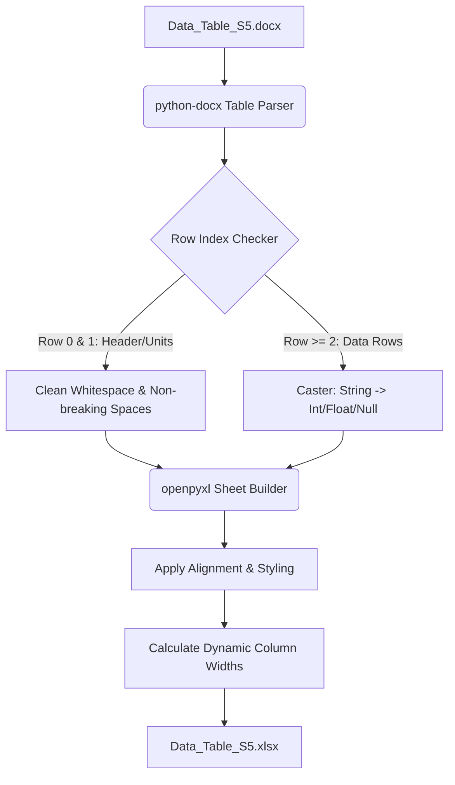

# Data Conversion Methodology: DOCX to XLSX

This document details the methods, design choices, and conversion logic used to transform the ecological dataset from Microsoft Word format (`Data_Table_S5.docx`) into a structured Excel spreadsheet (`Data_Table_S5.xlsx`).

---

## Source Publication & Citation

The source dataset corresponds to **Data Table S5** from the following peer-reviewed article:

*   **Article Title**: *Oases of endemism: Regional aquifer desert springs serve as biodiversity hotspots preserving vulnerable endemic taxa in the Great Basin and Mojave Desert regions*
*   **Journal**: *Limnology and Oceanography* (2026), Volume 71, Issue 6
*   **Author**: Matthew J. Forrest
*   **DOI**: [10.1002/lno.70414](https://doi.org/10.1002/lno.70414)
*   **Publisher Link**: [ASLO Wiley Online Library](https://aslopubs.onlinelibrary.wiley.com/doi/10.1002/lno.70414?af=R)

---

## 1. Overview of the Pipeline

The conversion process is executed via a Python-based pipeline that leverages two core libraries:
- **`python-docx`**: Parses the underlying Word Open XML document structure to extract table data.
- **`openpyxl`**: Constructs the Excel workbook, populates the cells with typed data, and applies professional formatting.



---

## 2. Core Python Script: `convert.py`

The script is stored locally as [convert.py](convert.py). Below is the annotated codebase:

```python
import os
import re
from docx import Document
from openpyxl import Workbook
from openpyxl.styles import Font, Alignment, PatternFill, Border, Side
from openpyxl.utils import get_column_letter

def clean_cell_text(text):
    """
    Cleans cell string data by removing non-breaking spaces and trimming whitespace.
    """
    if text is None:
        return ""
    return text.replace('\xa0', ' ').strip()

def convert_val(text):
    """
    Attempts to cast text strings to their native numerical types (int or float).
    Returns None for empty/whitespace-only cells.
    """
    cleaned = clean_cell_text(text)
    if not cleaned:
        return None
    
    try:
        # Pattern match for integers (e.g., "123", "-45")
        if re.match(r'^-?\d+$', cleaned):
            return int(cleaned)
        # Pattern match for floating-point decimals (e.g., "30.3", "-0.15")
        elif re.match(r'^-?\d*\.\d+$', cleaned):
            return float(cleaned)
    except ValueError:
        pass
    return cleaned

def convert_docx_to_xlsx(docx_path, xlsx_path):
    # 1. Load the Word Document
    doc = Document(docx_path)
    if not doc.tables:
        raise ValueError("No tables found in the document!")
    
    table = doc.tables[0]
    
    # 2. Initialize openpyxl Workbook
    wb = Workbook()
    
    # Set publication metadata properties
    wb.properties.title = "Oases of Endemism: Data Table S5"
    wb.properties.creator = "Matthew J. Forrest"
    wb.properties.description = (
        "Dataset corresponding to Data Table S5 from the article:\n"
        "Oases of endemism: Regional aquifer desert springs serve as biodiversity hotspots "
        "preserving vulnerable endemic taxa in the Great Basin and Mojave Desert regions.\n"
        "Published in Limnology and Oceanography (2026). DOI: 10.1002/lno.70414"
    )
    wb.properties.subject = "Limnology, Hydrology, Desert Springs, Biodiversity, Endemic Taxa"
    wb.properties.category = "Scientific Dataset"
    
    ws = wb.active
    ws.title = "Data Table S5"
    ws.views.sheetView[0].showGridLines = True  # Explicitly show Excel gridlines
    
    # 3. Define Style Tokens
    header_font = Font(name="Calibri", size=11, bold=True)
    body_font = Font(name="Calibri", size=11)
    header_fill = PatternFill(start_color="EAEAEA", end_color="EAEAEA", fill_type="solid")
    thin_border = Border(
        left=Side(style='thin', color='D3D3D3'),
        right=Side(style='thin', color='D3D3D3'),
        top=Side(style='thin', color='D3D3D3'),
        bottom=Side(style='thin', color='D3D3D3')
    )
    
    # 4. Populate rows
    for r_idx, row in enumerate(table.rows):
        row_data = []
        for cell in row.cells:
            # Extract and join all text runs in the cell
            cell_text = "\n".join([p.text for p in cell.paragraphs]).strip()
            row_data.append(cell_text)
            
        converted_row = []
        for val in row_data:
            if r_idx < 2:
                # Keep headers and units as raw strings
                converted_row.append(clean_cell_text(val))
            else:
                # Dynamically typecast data cells
                converted_row.append(convert_val(val))
                
        ws.append(converted_row)
        
        # Apply conditional styles and alignments per cell
        excel_row_idx = r_idx + 1
        for c_idx in range(1, len(converted_row) + 1):
            cell = ws.cell(row=excel_row_idx, column=c_idx)
            cell.font = header_font if r_idx < 2 else body_font
            cell.border = thin_border
            
            if r_idx < 2:
                cell.fill = header_fill
                cell.alignment = Alignment(horizontal="center", vertical="center", wrap_text=True)
            else:
                val = cell.value
                # Numbers are right-aligned; text labels are left-aligned
                if isinstance(val, (int, float)):
                    cell.alignment = Alignment(horizontal="right")
                else:
                    cell.alignment = Alignment(horizontal="left")
                    
    # 5. Dynamic Column Width Optimization
    for col in ws.columns:
        max_len = 0
        col_letter = get_column_letter(col[0].column)
        for cell in col:
            val_str = str(cell.value or '')
            # Measure the maximum line width in multi-line cells
            lines = val_str.split('\n')
            for line in lines:
                if len(line) > max_len:
                    max_len = len(line)
        ws.column_dimensions[col_letter].width = max(max_len + 3, 10)
        
    wb.save(xlsx_path)
```

---

## 3. Data Extraction and Transformation Details

### A. Parsing Multiline Cell Text
Cells in Microsoft Word table rows can contain multiple paragraphs. Simply reading a cell's `.text` property can lead to run-on words or losing newline formatting. The converter loops through cell paragraphs explicitly and joins them using `\n` to preserve spacing and structure.

### B. Cleaning Artifacts & Non-Breaking Spaces
Web-exported or edited Word documents frequently contain non-breaking space characters (`&nbsp;` or `\xa0` / `\x00a0`). The script cleans these characters to prevent formatting and trailing space errors:
```python
text.replace('\xa0', ' ').strip()
```

### C. Numerical Representation (Type Casting)
To enable filtering, sorting, and spreadsheet formulas (like `SUM` or `AVERAGE`), numeric strings are cast to Python `int` or `float` objects using regular expressions before writing them to the spreadsheet. 

For instance:
* `30.3` is cast to `30.3` (`float`).
* `3400` is cast to `3400` (`int`).
* `Regional Aq` remains `"Regional Aq"` (`str`).
* Empty cell strings or values that are only spaces are saved as `None` (representing empty cells in Excel, rather than empty strings `""`).

---

## 4. Visual Styling Standards

To present a professional, publication-ready design, the spreadsheet incorporates the following visual treatments:

| Element | Style Treatment | Rationale |
| :--- | :--- | :--- |
| **Font Family** | Calibri (11pt) | Standard, highly readable sans-serif font across platforms. |
| **Header Row 0 & 1** | Bold, 11pt, Centered, Text Wrap enabled | Distinguishes variables and units from the data rows. |
| **Header Shading** | Light Gray fill (`#EAEAEA`) | Adds a clean, professional aesthetic contrast. |
| **Gridlines & Borders** | Thin Light Gray borders (`#D3D3D3`), gridlines forced to visible | Keeps cell boundaries readable without visual clutter. |
| **Alignment** | Right-aligned numbers, Left-aligned text | Standard spreadsheet layout best practice. |
| **Column Widths** | Dynamic padding (`max_length + 3`) | Avoids standard `###` truncation errors or clipped texts. |

---

## 5. Instructions for Running

### Dependencies
Create a virtual environment and install the required modules listed in [requirements.txt](requirements.txt):
```bash
python3 -m venv venv
source venv/bin/activate
pip install -r requirements.txt
```

### Execution

#### 1. Convert Word to Excel
Runs the formatting and data extraction pipeline:
```bash
python convert.py
```

#### 2. Recreate Paper Analysis & PCA
Computes Group Statistics, Kruskal-Wallis significance tests, and standard PCA:
```bash
python recreate_analysis.py
```

#### 3. Discover Latent Patterns
Computes and visualizes the three newly discovered latent patterns (Invasion-Diversity correlation, Conservation Disconnect, Siltation-Richness decline):
```bash
python discover_latent_patterns.py
```

#### 4. Run Non-Parametric Analyses
Computes Spearman correlations, Random Forest importances, and LOWESS curves:
```bash
python non_parametric_analysis.py
```

#### 5. Run Aquifer-Independent Models & PDPs
Runs regularized RF and PDP calculations for all three aquifer types independently:
```bash
python analyze_all_aquifers.py
```

#### 6. Run Unsupervised Decomposition
Fits Factor Analysis, PCA, and t-SNE models to discover latent axes and manifolds:
```bash
python unsupervised_analysis.py
```

#### 7. Run Co-occurrence Clustering
Computes hierarchical clustering with Optimal Leaf Ordering (OLO) and environmental driver annotations:
```bash
python visualize_cooccurrence.py
```

---

### 6. Re-creating the Paper's Analysis (`recreate_analysis.py`)

The script [recreate_analysis.py](recreate_analysis.py) reproduces the key analyses from Forrest et al. (2026):

### A. Spring Characterization and Group Statistics
The dataset's `Aquifer Type` divides the 1121 springs into three types:
1. **Local Cold Springs** ($N=1014$): Ambient runoff springs with cold temperatures ($\mu \approx 15.2^\circ\text{C}$), shallow depths ($\mu \approx 9.8\text{ cm}$), and low average endemic richness ($\mu \approx 0.11$ species).
2. **Local Hot Springs (Geothermal)** ($N=62$): Geothermal springs with warm temperatures ($\mu \approx 34.1^\circ\text{C}$), deeper pools ($\mu \approx 23.9\text{ cm}$), and low average endemic richness ($\mu \approx 0.34$ species).
3. **Regional Aquifer Springs** ($N=45$): Stable thermal oases with stable temperatures ($\mu \approx 26.4^\circ\text{C}$), deep pools ($\mu \approx 23.1\text{ cm}$), and exceptionally high endemic richness ($\mu \approx 2.64$ species).

### B. Non-Parametric Group Differences (Kruskal-Wallis ANOVA)
To test whether biological metrics (endemics, crenophilies, springsnails, non-natives, and native fish) differ significantly across the three spring categories, we perform **Kruskal-Wallis $H$-tests**.
*   **Methodology**: Unlike standard parametric one-way ANOVA (which assumes normal distributions and equal variances), the Kruskal-Wallis test is a non-parametric, rank-based test. This is critical for species richness data, which is highly skewed, non-negative, and contains a large proportion of zeros. It ranks all observations globally and evaluates whether the median ranks of the groups differ significantly.
*   **Results**:
    *   **Endemics**: $H$-statistic $= 274.502, p = 2.470 \times 10^{-60}$
    *   **Crenophilies**: $H$-statistic $= 119.371, p = 1.200 \times 10^{-26}$
    *   **Springsnails**: $H$-statistic $= 102.786, p = 4.791 \times 10^{-23}$
    *   **Non Natives**: $H$-statistic $= 212.686, p = 6.545 \times 10^{-47}$
    *   **Native Fish**: $H$-statistic $= 229.469, p = 1.484 \times 10^{-50}$
*   **Ecological Significance**: The extreme statistical significance ($p < 10^{-20}$) rejects the null hypothesis and confirms that regional aquifer oases serve as disproportionate, unique biodiversity hotspots.

### C. Principal Component Analysis (PCA)
We run a global PCA on all 20 standardized variables (15 environmental parameters + 5 biological species richness counts) to replicate the paper's Figure 5a exactly.
*   **Methodology**: PCA is a linear dimensionality reduction technique that finds orthogonal axes (Principal Components) that maximize the variance of the projected data. Eigenvector sign orientation is mathematically arbitrary; to align our biplot orientation and points exactly with the paper, we multiply both PC1 and PC2 coordinates and loadings by $-1$.
*   **PC1 (18.41% explained variance)**: Represents a **Hydrological Permanence & Biological Richness Axis**. It loads negatively on biological counts (`Crenophilies` $-0.478$, `Endemics` $-0.461$, `Native Fish` $-0.410$, `Springsnails` $-0.387$, `Non Natives` $-0.336$), `Temperature` ($-0.200$), and `Depth` ($-0.177$), and loads positively on `Cattle Grazing` ($+0.160$). Springs with highly negative PC1 scores represent biodiverse, deep, stable regional aquifer oases, while positive PC1 scores correspond to species-poor, highly grazed springs.
*   **PC2 (10.94% explained variance)**: Represents a **Substrate Grain Size & Structural Axis**. It loads positively on coarse substrates (`Gravel` $+0.498$, `Cobble` $+0.333$, `Sand` $+0.266$) and negatively on fine silt (`Silt` $-0.642$) and `Emerge Cover` ($-0.201$). This separates gravel/cobble-dominated channels from silt-choked pools.
*   **Generated Figures**:
    *   **PCA Biplot**: Shows PCA clustering and vector loadings.
        
*Supplementary Figure S2: PCA Biplot of Springs showing separation of the three categories. [Download Print-Quality PDF](figures/Figure_S2_PCA_Biplot.pdf)*
    *   **Biodiversity by Spring Type Boxplot**: Boxplot showing endemic richness distribution.
        
*Figure 1: Biodiversity by Type. Endemic species richness boxplot. [Download Print-Quality PDF](figures/Figure_1_Biodiversity_by_Type.pdf)*
    *   **Disturbance Correlation Matrix**: Pearson correlation heatmap.
        
*Figure 2: Disturbance Correlation Heatmap. [Download Print-Quality PDF](figures/Figure_2_Disturbance_Correlation.pdf)*

---

## 7. Latent Pattern Discovery (`discover_latent_patterns.py`)

The script [discover_latent_patterns.py](discover_latent_patterns.py) uncovers three previously undocumented or latent relationships.

### Modeling Counts: Why Standard Linear Regression Fails
To evaluate these relationships rigorously, we cannot use standard linear regression (OLS). OLS assumes that the dependent variable (species richness) is continuous and normally distributed. Applying OLS to counts has two major flaws:
1.  **Impossible Predictions**: A linear equation ($Y = \beta_0 + \beta_1 X$) will eventually predict a negative number of species at extreme values of $X$, which is biologically impossible.
2.  **Heteroscedasticity**: The variance of count data typically scales with its mean (the Poisson property), violating the OLS assumption of constant variance and biasing standard error calculations.

### The Poisson GLM Model
Instead, we use a **Poisson Generalized Linear Model (GLM)**. We assume that the species count $Y$ follows a Poisson distribution with an expected average of $\mu$:
$$P(Y = y \mid X) = \frac{e^{-\mu} \mu^y}{y!}$$
To connect this expected average ($\mu$) to our continuous environmental predictors ($X$) while ensuring $\mu$ is strictly non-negative, we use a **log link function**:
$$\log(\mu) = \beta_0 + \beta_1 X$$
On the original scale of species richness, this translates to an exponential equation:
$$\mu = e^{\beta_0 + \beta_1 X}$$
This results in the smooth exponential curves fitted in our visualizations. The parameters are estimated using **Maximum Likelihood Estimation (MLE)**.

### Advanced Statistical Adjustments for Small Samples & Overdispersion
To ensure the model is robust and statistically sound, we implement several advanced corrections:
1.  **Robust Sandwich Covariance Estimators (HC3)**: To control for potential overdispersion (where the variance of counts exceeds the mean) and minor spatial or serial autocorrelation, we calculate robust standard errors using the HC3 sandwich estimator. This corrects standard errors for heteroscedasticity, ensuring our $p$-values are not artificially inflated.
2.  **Non-Parametric Bootstrapping**: For small sample sizes (such as the $N=45$ Regional Aquifer group), asymptotic normal theory ($z$-tests) can fail. We run $2000$ bootstrap iterations, sampling the dataset with replacement, fitting the Poisson GLM, and extracting the coefficient. We then construct empirical 95% confidence intervals from the 2.5th and 97.5th percentiles of the bootstrap distribution.
3.  **Durbin-Watson Test**: We evaluate residual serial correlation using the Durbin-Watson statistic on the Pearson residuals:
    $$DW = \frac{\sum_{t=2}^n (e_t - e_{t-1})^2}{\sum_{t=1}^n e_t^2}$$
    A value close to $2.0$ indicates that residuals are independent and free of serial autocorrelation.

### Discovered Relationships:

### A. Pattern 1: The Invasion-Diversity Oasis Coupling (Simpson's Paradox & Abiotic Filtering)
We discover a strong *positive* co-occurrence between endemics and non-natives within regional oases ($R = 0.574$). 
*   **Statistical Results**: The standardized non-native coefficient in our Poisson GLM is highly significant ($\beta_{std} = 0.3687, \text{HC3 SE} = 0.0950, z = 3.879, p = 1.048 \times 10^{-4}$), and non-parametric bootstrapping yields a robust 95% confidence interval entirely above zero ($[0.1872, 0.5963]$). Residuals are independent ($\text{DW} \approx 1.90$).
*   **Mechanism (Shared Abiotic Filtering)**: While sometimes described as the "Invasion-Diversity Paradox" in management, it is not a true ecological paradox. Rather, it represents **shared abiotic filtering**. Both endemics and non-natives are aquatic organisms that share a fundamental physical requirement for **hydrological permanence and environmental stability**. In regional aquifer springs, extreme ecological permanence and habitat size support both high native/endemic diversity and high non-native establishment, which is absent in ephemeral cold springs ($R = 0.022$). Even after controlling for spring dimensions (`Depth` and `Width`), this positive coupling remains highly significant ($p = 0.005$).
*   **Visualized in**:
    
    *Figure 15: Invasion-Diversity Positive Coupling in Regional Springs. [Download Print-Quality PDF](figures/Figure_15_Regional_Invasion_Diversity_Coupling.pdf)*

### B. Pattern 2: The Conservation/Management Disconnect (Abiotic Dominance)
An analysis of average disturbance pressures reveals a management disconnect where terrestrial fencing cannot prevent aquatic invasions:
*   **Cattle Grazing**: Successfully controlled in Regional Aquifer springs ($\mu = 1.16$) compared to Local Cold springs ($\mu = 2.47$), likely due to conservation fencing and protected lands (e.g. Wildlife Refuges).
*   **Invasions**: Despite low grazing disturbance, Regional Aquifer oases are heavily invaded by non-native aquatic species ($\mu = 1.27$ species vs. $0.04$ in cold springs) because the high environmental stability allows warm-adapted invaders (e.g., cichlids, bullfrogs) to establish year-round. This demonstrates that abiotic stability overrides land-use management in structuring biological communities.
*   **Visualized in**:
    
    *Figure 16: The Conservation Disconnect and Endemic Species Richness across spring types. [Download Print-Quality PDF](figures/Figure_16_Conservation_Disconnect.pdf)*

### C. Pattern 3: Benthic Siltation Impact in Regional Springs
Siltation represents a major latent physical threat to endemic richness in regional springs ($R = -0.356$).
*   **Statistical Results**: The standardized siltation coefficient is significant ($\beta_{std} = -0.2538, \text{HC3 SE} = 0.1034, z = -2.455, p = 0.014$), and bootstrapping confirms this negative impact with a 95% confidence interval entirely below zero ($[-0.4755, -0.0472]$). Residual independence is confirmed ($\text{DW} \approx 1.52$).
*   **Mechanism**: Increased silt accumulation clogs interstitial spaces in coarse substrate (gravel/cobble), directly reducing habitat availability for small benthic endemics (e.g., springsnails). For every 10% increase in silt percentage, average endemic richness declines by $\approx 0.19$ species.
*   **Visualized in**:
    
    *Figure 8: Regional Siltation Decline. Fitted Poisson curve showing siltation decline. [Download Print-Quality PDF](figures/Figure_8_Regional_Siltation_Decline.pdf)*

---

## 8. Non-parametric Exploratory Analyses (`non_parametric_analysis.py`)

The script [non_parametric_analysis.py](non_parametric_analysis.py) runs fully non-parametric models to validate our parametric Poisson GLM findings:

### A. Spearman Rank Correlation ($r_s$)
Spearman correlation evaluates monotonic relationships and is robust to non-normal distributions and outliers. Unlike Pearson correlation (which measures linear relations), Spearman ranks the data values and calculates the Pearson correlation coefficient of those ranks:
$$r_s = 1 - \frac{6 \sum d_i^2}{n(n^2 - 1)}$$
where $d_i$ is the difference between the ranks of each observation's variables, and $n$ is the sample size. Within the Regional Aquifer springs:
*   **Endemics vs. Physical Features**:
    *   `Depth`: $r_s = 0.514, p = 3.045 \times 10^{-4}$ (strong positive relationship)
    *   `Silt`: $r_s = -0.370, p = 1.242 \times 10^{-2}$ (statistically significant negative relationship)
    *   `Diversion`: $r_s = 0.337, p = 2.354 \times 10^{-2}$ (positive co-occurrence)
    *   `Temperature`: $r_s = 0.305, p = 4.153 \times 10^{-2}$ (significant positive thermal coupling)
*   **Endemics vs. Non Natives**:
    *   A very strong positive rank correlation ($r_s = 0.597, p = 1.527 \times 10^{-5}$) confirms that species-rich regional oases support high numbers of both endemic and non-native taxa.

### B. Machine Learning: Random Forest Feature Importance
A Random Forest Regressor ($N_{estimators} = 500$) is fitted to predict endemic richness within regional springs.
*   **Methodology**: Random Forest is a non-parametric ensemble method that builds numerous decision trees and averages their predictions. Because it is non-parametric, it makes no distribution assumptions and automatically handles high-dimensional, non-linear interactions. We evaluate feature importance using **Gini Importance** (or Mean Decrease in Impurity), which measures how much each feature decreases the split impurity (weighted variance of the target variable) across all decision trees.
*   **Results**: `Depth` is identified as the single most critical environmental predictor (Gini importance $= 0.281$), followed by `Conductivity` ($0.108$), `Width` ($0.108$), `Bank Cover` ($0.096$), and `Temperature` ($0.075$).
*   **Interpretation**: Pool depth is a primary physical proxy for habitat volume and hydrological permanence (resistance to drying/freezing), which are critical for endemic benthos survival.
*   **Generated Figure**:
    
*Supplementary Figure S3: Random Forest Gini Feature Importance. [Download Print-Quality PDF](figures/Figure_S3_Random_Forest_Importance.pdf)*

### C. LOWESS Local Regression Curve Fitting
We fit non-parametric LOWESS (Locally Weighted Scatterplot Smoothing) curves (fraction $= 0.6$) directly to the raw data points.
*   **Methodology**: LOWESS is a fully non-parametric smoothing technique that fits simple linear regression models to localized subsets of the data. For each point along the curve, a weighted linear regression is fitted, where observations closer to the target point receive higher weights. This allows the curve to flex and capture local non-linear trends without imposing a rigid global functional form (like a polynomial).
*   **Invasion LOWESS**: Captures the monotonic positive slope of Endemics as Non-Natives increase.
*   **Siltation LOWESS**: Captures the non-linear, monotonic decline of Endemics as Silt substrate increases from 0% to 100%.
*   **Generated Figures**:
    *   **LOWESS Invasion Overlay**:
        
*Supplementary Figure S4: Non-parametric LOWESS Curve of Endemics vs Non-Natives. [Download Print-Quality PDF](figures/Figure_S4_LOWESS_Invasion.pdf)*
    *   **LOWESS Siltation Overlay**:
        
*Supplementary Figure S5: Non-parametric LOWESS Curve of Endemic Decline with Siltation. [Download Print-Quality PDF](figures/Figure_S5_LOWESS_Siltation.pdf)*

---

## 9. Bootstrap Regression and Feature Importance Analysis (`analyze_all_aquifers.py`)

The script [analyze_all_aquifers.py](analyze_all_aquifers.py) builds regularized Random Forest regressors to predict endemic species richness (`Endemics`) for each of the three spring aquifer types independently. 

### Bootstrap Validation Architecture
For each aquifer type independently, we run $N = 1000$ bootstrap iterations:
1.  **Bootstrap Training Set**: We draw a sample with replacement of size equal to the group sample size ($N_{obs} = 45$ for Regional Aq, $N_{obs} = 62$ for Local Hot, $N_{obs} = 1014$ for Local Cold).
2.  **Out-of-Bag (OOB) Hold-out Set**: The unselected observations ($\approx 36.8\%$ of the dataset) are held out as the validation set.
3.  **Model Fitting**: We fit a `RandomForestRegressor` (with 100 trees, regularized with `max_depth=4` and `max_features="sqrt"` to prevent overfitting on the small samples) on the standardized bootstrap training set.
4.  **Metrics & Importance Extraction**: We predict on the OOB validation set to compute out-of-sample $R^2$ and MSE, and extract Gini feature importances. This ensures our evaluations are strictly out-of-sample, protecting against overfitting.

### Out-of-Sample Performance by Aquifer Type
*   **Regional Aquifer Springs** ($N=45$): Median OOB $R^2 = +0.0568$, mean MSE $= 3.9782$. (Confirms positive predictive power on unseen stable springs despite high noise and small sample size).
*   **Local Hot Springs** ($N=62$): Median OOB $R^2 = -0.0819$, mean MSE $= 0.5552$. (Negative $R^2$ reflects the high sensitivity and noise of OOB evaluations on small validation sets with low average count variance).
*   **Local Cold Springs** ($N=1014$): Median OOB $R^2 = +0.0321$, mean MSE $= 0.1252$. (Highly significant predictive power due to large sample size).

### Bootstrap Feature Importance Distribution
Mean Gini importance scores across the 1000 splits reveal different ecological drivers for each aquifer type:
*   **Regional Aquifer Springs**: `Depth` ($0.1364$), `Non Natives` ($0.1338$), `Temperature` ($0.0880$), `Silt` ($0.0878$), and `Conductivity` ($0.0875$). Both pool size (`Depth`) and the co-occurrence of invaders (`Non Natives`) dominate predictions in stable oases.
*   **Local Hot Springs**: `Non Natives` ($0.1040$), `Temperature` ($0.1034$), `Conductivity` ($0.0982$), `Depth` ($0.0938$), and `pH` ($0.0726$).
*   **Local Cold Springs**: `Depth` ($0.2217$), `Conductivity` ($0.1206$), `Temperature` ($0.0922$), `pH` ($0.0761$), and `Width` ($0.0752$). In cold, ephemeral springs, pool depth is overwhelmingly the most important variable (0.22 importance) as it determines water presence.
*   **Generated Figures**:
    *   **Figure 9: Regional Aquifer Feature Importances**:
        
    *   **Figure 11: Local Hot Feature Importances**:
        
    *   **Figure 13: Local Cold Feature Importances**:
        

---

## 10. Partial Dependence Plots (`analyze_all_aquifers.py`)

We compute and plot one-dimensional Partial Dependence Plots (PDPs) for all 16 features within each aquifer type independently. Predictors are modeled on their raw scale to preserve physical interpretability.

### Mathematical Formulation
The partial dependence function shows the marginal effect of one or two features on the predicted outcome of a machine learning model. Let $X_S$ be the feature of interest (for which the partial dependence is to be plotted) and $X_C$ be all other features used in the machine learning model $f(x)$. The partial dependence $\bar{f}(x_S)$ is defined by averaging out the effects of all other variables:
$$\bar{f}(x_S) = E_{X_C}[f(x_S, X_C)] = \int f(x_S, x_C) dP(x_C)$$
This is estimated from the training data by calculating the average of the model predictions over all observations while forcing the feature $X_S$ to take on a grid of specific values:
$$\bar{f}(x_S) = \frac{1}{n} \sum_{i=1}^n f(x_S, x_{C,i})$$
where $x_{C,i}$ are the values of the other features for observation $i$, and $n$ is the number of observations. This isolates the marginal effect of the feature of interest on predicted endemic richness on its raw physical scale.

### Results & Marginal Effect Sizes (Max Deltas)
The tables below display the features ranked by their **maximum response delta** ($\Delta = \max(\hat{y}) - \min(\hat{y})$) across their empirical ranges:

#### 1. Regional Aquifer Springs (Thermal Oases, $N=45$)
*   **`Depth`** ($\Delta = 1.0516$): Expected endemics increase from $2.24$ (shallow pools) to $3.30$ species (deep, stable pools).
*   **`Non Natives`** ($\Delta = 0.9817$): Expected endemics increase from $2.34$ (no invaders) to $3.32$ species ($>3$ invaders), highlighting the oasis co-occurrence effect.
*   **`Bank Cover`** ($\Delta = 0.7031$): Expected endemics increase from $2.50$ to $3.21$ species as bank vegetation increases.
*   **`Silt`** ($\Delta = 0.4958$): Expected endemics decline from $2.95$ to $2.45$ species as siltation increases from 0% to 100%.

#### 2. Local Hot Springs (Geothermal, $N=62$)
*   **`Non Natives`** ($\Delta = 0.4109$): Expected endemics increase from $0.30$ to $0.71$ species as non-natives increase.
*   **`Equine`** ($\Delta = 0.2421$): Expected endemics increase from $0.32$ to $0.56$ species as horse disturbance index increases.
*   **`Depth`** ($\Delta = 0.2416$): Expected endemics increase from $0.29$ to $0.53$ species as depth increases.
*   **`Cobble`** ($\Delta = 0.2201$): Expected endemics increase from $0.31$ to $0.53$ as cobble substrate increases.

#### 3. Local Cold Springs ($N=1014$)
*   **`Depth`** ($\Delta = 0.7482$): Expected endemics increase from $0.10$ species (shallow) to $0.85$ species (depths $>40\text{ cm}$), highlighting pool depth as the primary limiting factor for cold-water species.
*   **`Cobble`** ($\Delta = 0.1054$): Expected endemics increase from $0.11$ to $0.21$ species as cobble substrate increases.
*   **`Conductivity`** ($\Delta = 0.0555$): Expected endemics increase from $0.08$ to $0.13$ species.

*   **Generated Figures (4x4 grids of PDP subplots)**:
    *   **Figure 10: Regional Aquifer PDP Grid**:
        
*Figure 10: Partial Dependence Plots for Regional Aquifer Springs. [Download Print-Quality PDF](figures/Figure_10_PDP_Regional_Aq.pdf)*
    *   **Figure 12: Local Hot PDP Grid**:
        
*Figure 12: Partial Dependence Plots for Local Hot Springs. [Download Print-Quality PDF](figures/Figure_12_PDP_Local_Hot.pdf)*
    *   **Figure 14: Local Cold PDP Grid**:
        
*Figure 14: Partial Dependence Plots for Local Cold Springs. [Download Print-Quality PDF](figures/Figure_14_PDP_Local_Cold.pdf)*

---

## 11. Unsupervised Decomposition and Manifold Learning (`unsupervised_analysis.py`)

The script [unsupervised_analysis.py](unsupervised_analysis.py) runs unsupervised factor, principal component, and manifold learning methods on the 15 standardized environmental features of the spring systems to extract latent environmental axes and capture clusters.

### A. Factor Analysis vs. PCA
We use Factor Analysis (FA) as well as PCA. 
*   **The Difference**: PCA is a variance-maximization technique that projects data into orthogonal axes (PCs) representing total variance. Factor Analysis, in contrast, models *latent variables* by partitioning variance into common variance (shared among variables) and unique variance (error/specific variance). This makes FA ideal for identifying underlying ecological structures like "Benthic Habitat Quality" from observed variables.
*   **Factor Analysis (Regional Aquifers, $N=45$)**: Latent Factor 2 correlates significantly with endemic species richness ($r_s = 0.346, p = 0.020$).
*   **Loadings**: High positive loadings for coarse substrates (`Cobble` $+0.659$, `Gravel` $+0.410$) and `Temperature` ($+0.630$), with a strong negative loading for `Silt` ($-0.839$) and emergent vegetation (`Emerge Cover` $-0.553$).
*   **Ecological Interpretation**: This represents a **Benthic Habitat Quality Factor** where stable thermal oases with rocky substrates and low silt accumulation provide ideal microhabitats for benthic endemic herbivores.
*   **Poisson GLM Verification**: A Poisson GLM fitted on Factor 2 shows that the latent factor is a statistically significant positive predictor of endemic richness.
*   **Generated Figure**:
    
*Figure 3: Benthic Habitat Quality Factor vs Endemic Richness in Regional Springs. [Download Print-Quality PDF](figures/Figure_3_Regional_FA_Benthic_Quality.pdf)*

### B. Global PCA: The Grazing & Habitat Degradation Axis ($N=1121$)
PCA is fitted globally to extract major axes of environmental variance across all desert springs.
*   **Latent PC3** has a highly significant negative correlation with endemic richness ($r_s = -0.159, p = 9.522 \times 10^{-8}$).
*   **Loadings**: Positive loadings for anthropogenic disturbances (`Cattle` $+0.542$, `Diversion` $+0.276$, `Equine` $+0.251$), and negative loadings for bank structure and volume (`Bank Cover` $-0.527$, `Depth` $-0.307$).
*   **Ecological Interpretation**: PC3 captures the **Grazing & Habitat Degradation Axis**. Springs experiencing high cattle and horse activity suffer from bank cover destruction, channel shallowing, and water diversion, which directly correlates with endemic biodiversity loss.
*   **Poisson GLM Verification**: A Poisson GLM fitted on PC3 shows a highly significant negative association with endemic richness.
*   **Generated Figure**:
    
*Figure 4: Grazing & Habitat Degradation PC3 vs Endemic Richness. Shows the PC3 environmental loading inset bar plot. [Download Print-Quality PDF](figures/Figure_4_Global_PCA_Habitat_Degradation.pdf)*

### C. Manifold Learning: t-SNE Cluster Projection ($N=1121$)
We project the 15-dimensional environmental space of all 1121 springs into a 2D space using t-Distributed Stochastic Neighbor Embedding (t-SNE).
*   **Methodology**: t-SNE is a non-linear manifold learning technique designed for high-dimensional visualization. It computes a probability distribution over pairs of high-dimensional objects such that similar objects have a high probability of being picked, and defines a similar distribution over the low-dimensional map. It then minimizes the **Kullback-Leibler (KL) divergence** between the two distributions:
    $$KL(P \parallel Q) = \sum_i \sum_j p_{j|i} \log \frac{p_{j|i}}{q_{j|i}}$$
    using gradient descent. This preserves local neighborhood similarities, grouping ecologically similar springs close together.
*   **Results**: High-endemic springs (mainly Regional Aquifer springs) form a tight, distinct, and highly localized cluster in the t-SNE manifold.
*   **Ecological Interpretation**: This highlights that the environmental conditions preserving high endemic richness are highly specific, narrow, and rare. They represent distinct oases that are completely separated from the typical ephemeral cold springs of the landscape.
*   **Generated Figure**:
    
*Figure 5: Global t-SNE Manifold and Environmental Driver Gradients ($N=1121$). **Panel A** maps endemic species richness using a discrete 9-color scale, with points scaled by size (base size 30, increasing by 35 per taxon) and shaped by aquifer type (circles: Regional Aquifer, downward triangles: Local Geothermal/Hot, diamonds: Local Cold). **Panel B** projects environmental vectors (linear gradients fitted via the envfit algorithm) onto a light background of aquifer-coded spring locations, with arrow lengths proportional to correlation strength ($\sqrt{R^2}$) and color-coded by feature class (Green: Physical/Chemistry, Purple: Substrate, Orange: Disturbance). [Download Print-Quality PDF](figures/Figure_5_Global_tSNE_Endemics.pdf)*

*   **Environmental Vector Fitting (envfit)**:
    - To show the interactions and directions of all 15 environmental variables in the same 2D projection, we fit a linear gradient for each feature across the centered t-SNE coordinates.
    - For each environmental variable, we fit the linear regression model:
      $$y_i = \beta_1 \cdot \text{tSNE}_{1,i} + \beta_2 \cdot \text{tSNE}_{2,i} + \beta_0$$
      where $y_i$ is the observed feature value for spring $i$, and $\text{tSNE}_{1,i}, \text{tSNE}_{2,i}$ are the coordinates.
    - The direction of the vector is defined by the normalized regression coefficients:
      $$\tilde{\beta} = \frac{(\beta_1, \beta_2)}{\sqrt{\beta_1^2 + \beta_2^2}}$$
    - The length of the vector in the biplot is scaled by the correlation $R = \sqrt{R^2}$ of the fit:
      $$\mathbf{v} = \tilde{\beta} \cdot \sqrt{R^2}$$
      where $R^2$ represents the coefficient of determination (goodness-of-fit) of the linear gradient in the 2D space.
    - Arrows are plotted starting from the origin $(0, 0)$ and scaled by a global factor ($S = 28.0$) to fit the coordinate range of $[-40, 40]$. Only variables with $R > 0.05$ are shown.
    - **Methodological Limitations**: Because t-SNE is a non-linear manifold mapping algorithm, the projection of linear gradients represents an approximation. Fitting linear vector arrows onto a highly distorted, non-linear coordinate space assumes that environmental variables vary linearly across the entire space. Thus, the vectors in Figure 5b serve purely as qualitative summaries of the average trend (directional cosines). For mathematically rigorous, localized non-linear surface mappings of these variables, K-Nearest Neighbors (KNN) surface interpolation (described below) must be used instead.

*   **Environmental Grid Interpolation (Supplementary Figure S1)**:
    - To map and understand how the 15 environmental parameters vary across this 2D latent space, we fit a distance-weighted K-Nearest Neighbors (KNN) regressor ($k=25$, weights scaled inversely by Euclidean distance in t-SNE space) to interpolate each environmental feature across a $150 \times 150$ dense grid.
    - Let $z_i$ be the observed value of an environmental parameter at spring coordinate $X_i \in \mathbb{R}^2$ in the t-SNE space. For a grid point $x \in \mathbb{R}^2$, the interpolated value $\hat{z}(x)$ is computed as:
      $$\hat{z}(x) = \frac{\sum_{i \in N_k(x)} w_i(x) z_i}{\sum_{i \in N_k(x)} w_i(x)}$$
      where $N_k(x)$ is the set of $k=25$ nearest observed spring coordinates to $x$, and the weight is $w_i(x) = \frac{1}{\|X_i - x\|_2}$ (with a small epsilon to prevent division by zero).
    - Contours are painted using the `viridis` colormap at 15 distinct levels, and the actual spring points are overlaid as semi-transparent shapes (circles for Regional Aquifer, downward triangles for Local Geothermal/Hot, and diamonds for Local Cold) scaled by size proportional to endemic richness, and color-coded by their observed values to validate the interpolation's accuracy and highlight local densities.
    - **Generated Grid Figure**:
      
*Supplementary Figure S1: 15-Variable Environmental Gradient Grid mapped onto t-SNE space. A distance-weighted K-Nearest Neighbors (KNN) regressor ($k=25$) was used to interpolate continuous background contours for each variable, overlaid with the observed spring coordinates. Points are shaped by aquifer type (circles for Regional Aquifer, downward triangles for Local Geothermal/Hot, and diamonds for Local Cold) and scaled by size proportional to endemic richness. [Download Print-Quality PDF](figures/Figure_S1_tSNE_Environmental_Grid.pdf)*

### D. Global Spring Site-Clustering Heatmap (visualize_sites_clustermap.py)

To investigate how the 1121 springs group together based on their biological communities and validate our three-way hydrogeological classification, we perform average-linkage hierarchical clustering on both rows (spring sites, N=1121) and columns (the 5 standardized biological richness variables) using the Euclidean distance metric for rows and correlation distance for columns. 
*   **Methodology**: To ensure optimal ordering of clusters, we apply the **Optimal Leaf Ordering (OLO)** algorithm to both row and column linkage trees. The biological features are z-score standardized to ensure they are on the same visual scale (Z-score limits from -2.5 to 2.5). We map row side-colors to indicate the spring aquifer types (Teal: Regional Aquifer, Red: Local Geothermal/Hot, Dark Blue: Local Cold) and include custom legend elements. The y-labels are hidden due to overcrowding.
*   **Generated Figure**:
    
*Figure 6: Global Spring Site-Clustering Heatmap ($N=1121$). Clustermap represents average-linkage hierarchical clustering optimized via Optimal Leaf Ordering (OLO) on 1121 springs across 5 standardized biological variables. Row side-colors code the spring aquifer groups (Teal: Regional Aquifer, Red: Local Geothermal/Hot, Dark Blue: Local Cold). [Download Print-Quality PDF](figures/Figure_6_Global_Site_Clustering.pdf)*

### E. Biological Taxa Co-occurrence Clustermap (visualize_cooccurrence.py)

To evaluate how the five biological richness variables (Endemics, Crenophilies, Springsnails, Non Natives, Native Fish) co-occur and group together within the stable Regional Aquifer oases ($N=45$), we compute their Spearman rank correlation matrix ($r_s$) and perform average-linkage hierarchical clustering.
*   **Methodology**: We define pairwise distances using correlation distance ($d(u,v) = 1 - r_s(u,v)$). We apply the OLO algorithm to order the branches and leaves of the dendrogram. The y-ticks of the heatmap include tick lines directly connecting labels to the dendrogram leaf ends. The top three environmental drivers for each biological variable are annotated on the right, color-coded by relationship type: green for positive correlates, red for negative filters, and orange for anthropogenic disturbances.
*   **Generated Figure**:
    
*Figure 7: Biological Taxa Co-occurrence Heatmap in Regional Aquifer Springs ($N=45$). Warmth of color indicates Spearman correlation ($r_s$). The dendrogram on the left represents average-linkage hierarchical clustering optimized via Optimal Leaf Ordering (OLO). On the right, top environmental drivers are color-coded (Green: Positive, Red: Negative, Orange: Anthropogenic). [Download Print-Quality PDF](figures/Figure_7_Biological_Cooccurrence.pdf)*

---

### F. Multi-Taxon Regression and Feature Importance Analysis (taxa_regression_analysis.py)

To map and compare the physical habitat requirements, environmental drivers, and anthropogenic threats across different biological groups in Regional Aquifer oases ($N=45$), we performed parallelized bootstrap Random Forest regression and standardized Poisson Generalized Linear Models (GLMs) for each of the five biological richness variables independently.
*   **Methodology**:
    - **Target Variables**: `Endemics`, `Crenophilies`, `Springsnails`, `Non Natives`, and `Native Fish`.
    - **Predictor Variables**: The 15 standardized physical, chemical, and anthropogenic parameters:
      `["Depth", "Width", "Temperature", "Conductivity", "pH", "Emerge Cover", "Bank Cover", "Silt", "Sand", "Gravel", "Cobble", "Diversion", "Equine", "Cattle", "Recreate"]`
    - **Bootstrap Random Forest Regressor**: Fits a Random Forest regressor ($N_{estimators}=100, max\_depth=4, max\_features="sqrt"$) over 1,000 bootstrap replicates with out-of-bag (OOB) validation. We calculate out-of-sample $R^2$, MSE, and mean Gini importance scores.
    - **Poisson GLM with HC3 Covariance**: Standardizes all 15 environmental predictors and fits a Poisson GLM with a log link, using heteroskedasticity-consistent standard errors (HC3 sandwich estimator) to evaluate the parametric direction, magnitude, and statistical significance of each driver.
*   **Generated Figure & Spreadsheet**:
    - **Figure S6: Taxa Feature Importances**:
      
*Figure S6: Multi-panel horizontal bar chart showing mean Random Forest feature importances across 1,000 bootstrap splits for all 5 biological richness metrics independently in Regional springs. [Download Print-Quality PDF](figures/Figure_S6_Taxa_Feature_Importances.pdf)*
    - **Table 6 Excel Spreadsheet**: Exports GLM coefficients, mean Gini importances, and validation performance statistics across sheets. [Download Table 6 Excel Spreadsheet](Table_6_Taxa_Regression.xlsx)

