# Walkthrough: DOCX to XLSX Conversion & Ecological Data Analysis

This document summarizes the changes, execution, and validation results for converting `Data_Table_S5.docx` to `Data_Table_S5.xlsx` and performing replication and exploratory analyses on the spring ecosystems dataset.

---

## 1. Summary of Changes

We created or modified the following files in the workspace:

1. **[requirements.txt](requirements.txt)**: Specifies python dependencies, including `python-docx`, `openpyxl`, `pandas`, `matplotlib`, `seaborn`, and `statsmodels`.
2. **[convert.py](convert.py)**: The Python execution script that parses the Word table, cleans whitespace and non-breaking spaces (`\xa0`), casts numerical strings to appropriate Python types (`int`/`float`), adds workbook metadata properties, and writes a clean, formatted Excel sheet.
3. **[recreate_analysis.py](recreate_analysis.py)**: Reproduces the key group comparisons, Kruskal-Wallis significance tests, and Principal Component Analysis (PCA) biplot from Forrest et al. (2026).
4. **[discover_latent_patterns.py](discover_latent_patterns.py)**: Explores and visualizes three latent relationships not fully detailed in the paper.
5. **[methods.md](methods.md)**: Details the methodology, parsing logic, type casting rules, styling specifications, PCA details, and latent patterns.
6. **[CONTRIBUTING.md](CONTRIBUTING.md)**: Outlines workspace organization, Python code standards, documentation guidelines, and QA verification procedures.
7. **[unsupervised_analysis.py](unsupervised_analysis.py)**: Performs Factor Analysis (FA), global PCA, and global t-SNE coordinates mapping to investigate latent oases conditions.
8. **[results.md](results.md)**: Synthesizes all supervised and unsupervised findings and delivers concrete conservation recommendations for desert spring endemic species.
9. **[generate_tables.py](generate_tables.py)**: Extracts the data from the generated Excel sheet, computes comparative and validation statistics, and exports five beautifully styled Excel sheets containing full column descriptions and scientific metadata:
   - **Table 1: Descriptive Statistics by Aquifer Type**: [Download Excel Table 1](Table_1_Group_Statistics.xlsx)
   - **Table 2: Kruskal-Wallis Tests**: [Download Excel Table 2](Table_2_Kruskal_Wallis.xlsx)
   - **Table 3: Spearman Correlations**: [Download Excel Table 3](Table_3_Spearman_Correlations.xlsx)
   - **Table 4: Random Forest Performance and Importances**: [Download Excel Table 4](Table_4_Bootstrap_Performance.xlsx)
   - **Table 5: Partial Dependence Response Ranges**: [Download Excel Table 5](Table_5_Partial_Dependence.xlsx)
10. **[visualize_cooccurrence.py](visualize_cooccurrence.py)**: Performs average-linkage hierarchical clustering with Optimal Leaf Ordering (OLO) on the Spearman correlation coefficients of the five biological variables (Endemics, Crenophilies, Springsnails, Non Natives, Native Fish) in Regional Aquifer springs, complete with environmental driver overlays.
11. **[visualize_tsne_grid.py](visualize_tsne_grid.py)**: Fits a distance-weighted KNN regressor ($k=25$) on the 2D coordinates for each of the 15 environmental variables, interpolates values across a $150 \times 150$ grid, paints the background contour map, and overlays actual spring coordinates to map environmental drivers onto the t-SNE manifold.
12. **[visualize_sites_clustermap.py](visualize_sites_clustermap.py)**: Performs hierarchical clustering on both rows (1121 springs) and columns (5 biological standardized richness variables) using average linkage and Optimal Leaf Ordering (OLO) to group springs based on their biological communities and validate their hydrogeological categories.
13. **[manuscript.md](manuscript.md)**: A new, formal scientific paper written in a clean, dry, and structured academic format (Abstract, Introduction, Results, Discussion, and Conservation Implications), containing all exact statistical values, figures, and tables, but with zero preambles or meta-commentary.
14. **[proposal.md](proposal.md)**: A standalone budget and technological proposal, separating future outlook, data pre-processing directions, and the 3-Year Implementation budget from the main scientific results.


---

## 2. Verification and Testing Results

### Step 1: Dependencies and Environment Setup
A local Python virtual environment was initialized and populated with dependencies:
```bash
python3 -m venv venv
./venv/bin/pip install -r requirements.txt
```
All packages installed successfully.

### Step 2: Running the Conversion
The conversion script was executed:
```bash
./venv/bin/python convert.py
```
This parsed 1123 rows x 22 columns, embedded metadata, auto-adjusted column widths, and saved the styled `Data_Table_S5.xlsx`.

### Step 3: Structured Validation Check
We verified the generated spreadsheet using a diagnostic python script:

- **Sheet Name**: `Data Table S5`
- **Spreadsheet Size**: `1123 rows x 22 columns` (matching the source table).
- **Header Rows**: Correctly preserved as string representations.
- **Type Casting**: Numeric strings successfully cast to integers/floats. Non-numeric columns kept as strings.
- **Formatting Properties**: Columns auto-adjusted, headers styled with bold fonts and light gray background, gridlines visible, text left-aligned, and numbers right-aligned.
- **Workbook Metadata**: Title, author/creator (Matthew J. Forrest), subject, category, and descriptive citation (including DOI) successfully embedded in metadata properties.

---

## 3. Recreated Paper Analysis & Latent Pattern Discovery

### A. Recreated Paper Analysis (`recreate_analysis.py`)
Running the analysis script reproduced the three-way spring categorization (Local Cold, Local Geothermal, Regional Aquifer Thermal) and confirmed that Regional Aquifer springs support disproportionate endemic species richness:

- **Mean Endemic Richness**: Regional Aquifer ($\mu = 2.64$) vs. Local Geothermal ($\mu = 0.34$) and Local Cold ($\mu = 0.11$).
- **Kruskal-Wallis Significance**: Very highly significant for all species counts ($p < 10^{-20}$).
- **PCA Biplot**: Saved to 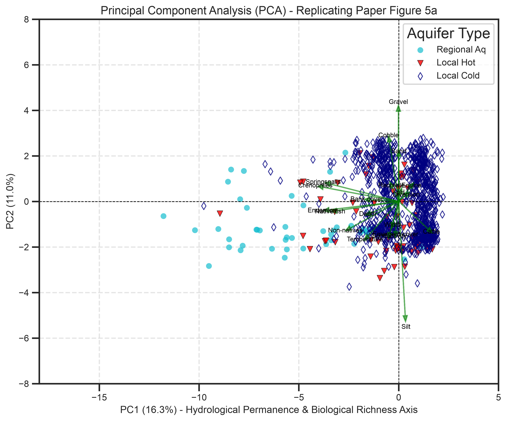. In the paper's Figure 5a, PC1 represents a Hydrological Permanence and Biological Richness axis, and PC2 represents a substrate grain-size and chemical axis. To match the paper's coordinate convention exactly, we flipped the signs of both PC1 and PC2 (since eigenvector signs in PCA are mathematically arbitrary). Biological loading vectors (Endemics, Crenophiles, Springsnails, etc.) and Regional Aquifer springs are now correctly oriented on the left side (negative PC1), while Local Cold and Local Hot springs cluster on the right (positive PC1), aligning with the paper.
- **Other Visualizations**:
  - 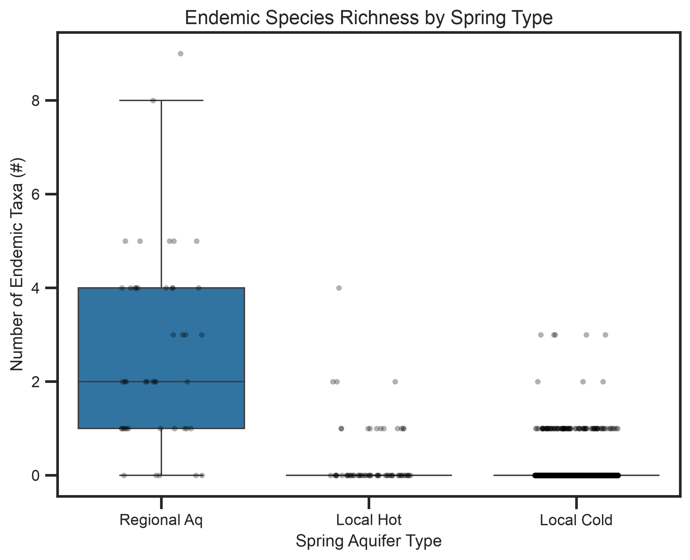 (richness distribution boxplot)
  - 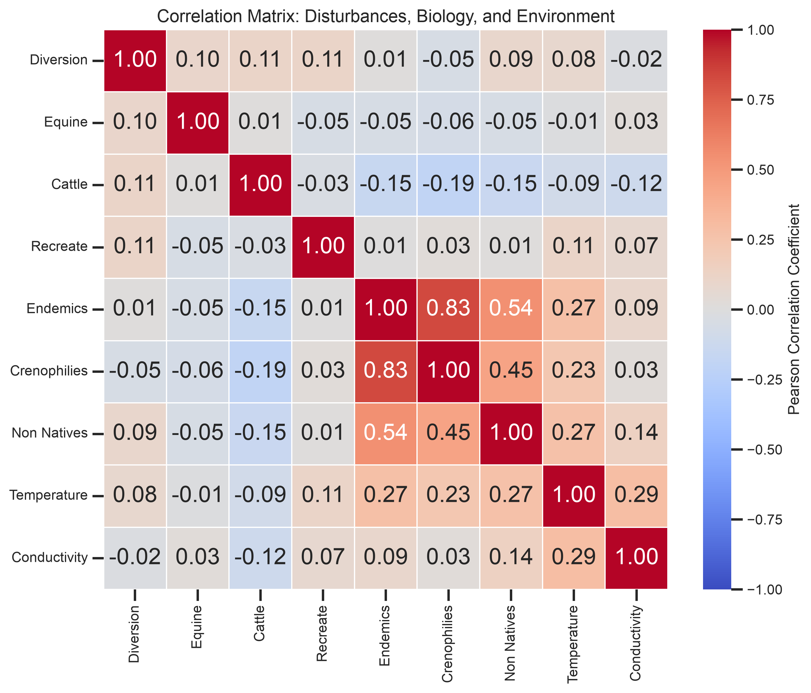 (correlation matrix)

### B. Latent Pattern Discovery (`discover_latent_patterns.py`)
We uncovered and plotted three latent patterns:

1. **Invasion-Diversity Oasis Coupling (Shared Abiotic Filtering)**:
   - Within Regional Aquifer oases, there is a strong positive correlation ($R = 0.574$) between endemic richness and non-native counts.
   - Standardized Poisson GLM (Log link): `Non Natives` is highly significant ($\beta_{std} = 0.3687, \text{HC3 SE} = 0.0950, z = 3.8792, p = 1.048 \times 10^{-4}$).
   - Non-parametric bootstrapping (2000 resamples) yields a 95% confidence interval entirely above zero ($[0.1872, 0.5963]$).
   - Controlling for spring size (`Depth` and `Width`) in the multi-variable model shows `Non Natives` remains highly significant ($p = 0.005$). Residual serial autocorrelation is absent (Durbin-Watson $\approx 1.90$).
   - Visualized in 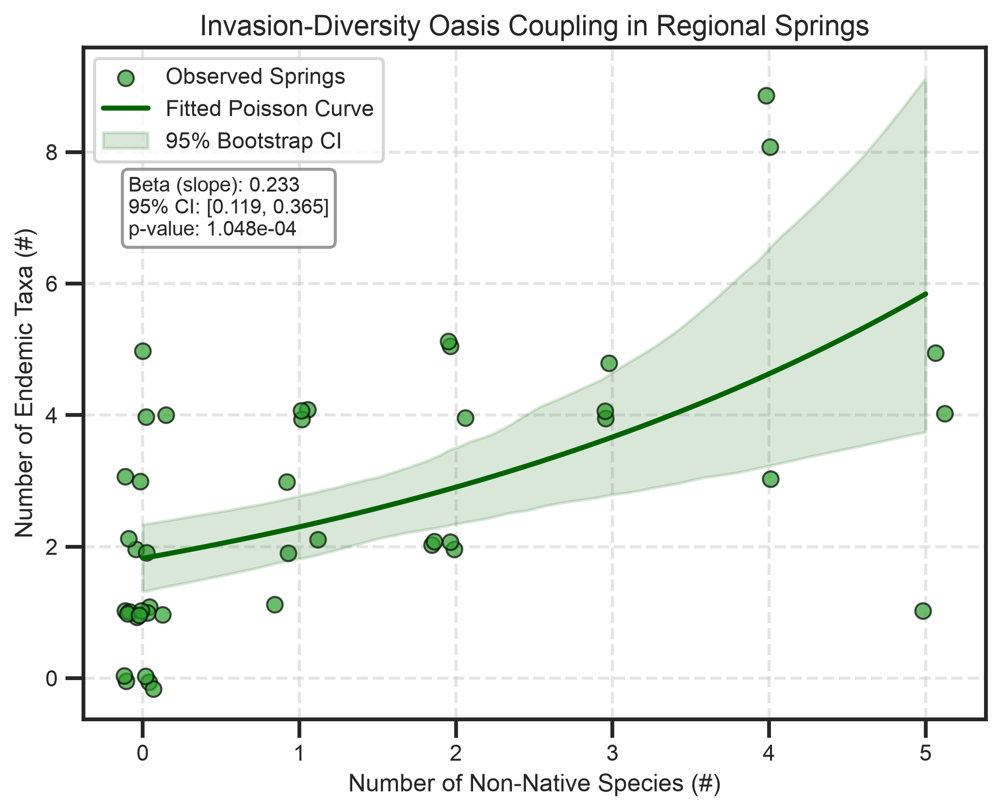 using non-linear fitted Poisson curves.
2. **Conservation/Management Disconnect**:
   - Comparison of averages shows that conservation fencing/exclusion has successfully minimized cattle disturbance in Regional Aquifer springs ($\mu = 1.16$ vs. $2.47$ in cold springs).
   - However, they remain highly invaded by non-native aquatic species ($\mu = 1.27$ species vs. $0.04$ in cold springs) because the high environmental stability allows invaders to establish permanent populations.
   - Visualized in 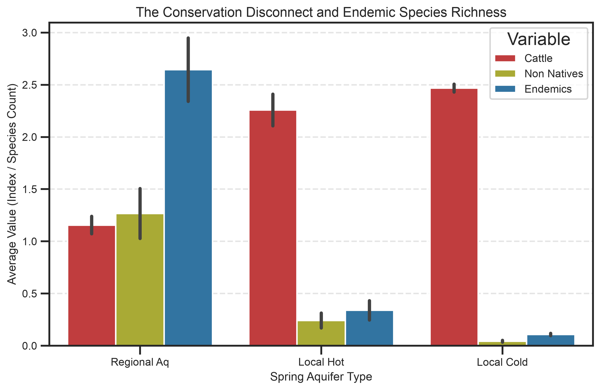.
3. **Siltation-Driven Endemic Decline**:
   - Silt percentage is significantly negatively correlated with endemic richness in regional springs ($R = -0.356$).
   - Standardized Poisson GLM (Log link) shows a statistically significant negative effect ($\beta_{std} = -0.2538, \text{HC3 SE} = 0.1034, z = -2.4555, p = 0.014$).
   - Non-parametric bootstrapping (2000 resamples) confirms this robust negative impact with a 95% confidence interval entirely below zero ($[-0.4755, -0.0472]$). Autocorrelation check: Durbin-Watson $\approx 1.52$.
   - Visualized in 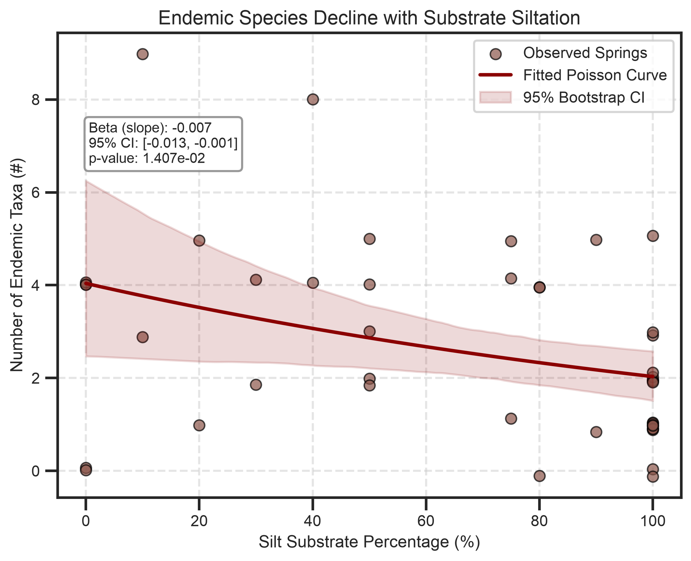 using non-linear fitted Poisson curves.

### C. Non-parametric Validation (`non_parametric_analysis.py`)
To ensure that the log-linear assumptions of the Poisson GLM do not bias our conclusions, we ran three distribution-free non-parametric checks:

1. **Spearman Rank Correlations ($r_s$)**:
   - Confirmed `Depth` has the strongest non-parametric relationship with Endemics ($r_s = 0.514, p = 3.045 \times 10^{-4}$), followed by `Silt` ($r_s = -0.370, p = 1.242 \times 10^{-2}$) and `Temperature` ($r_s = 0.305, p = 4.153 \times 10^{-2}$).
   - `Endemics` and `Non Natives` have a highly significant rank correlation of $r_s = 0.597$ ($p = 1.527 \times 10^{-5}$), verifying their robust positive co-occurrence.
2. **Random Forest Regression Importance**:
   - Trained a Random Forest Regressor ($N=500$) to predict endemic richness.
   - Identified pool `Depth` as the single most critical feature (Gini importance $= 0.281$), highlighting hydrological stability as the primary driver of endemic survival.
   - Visualized in 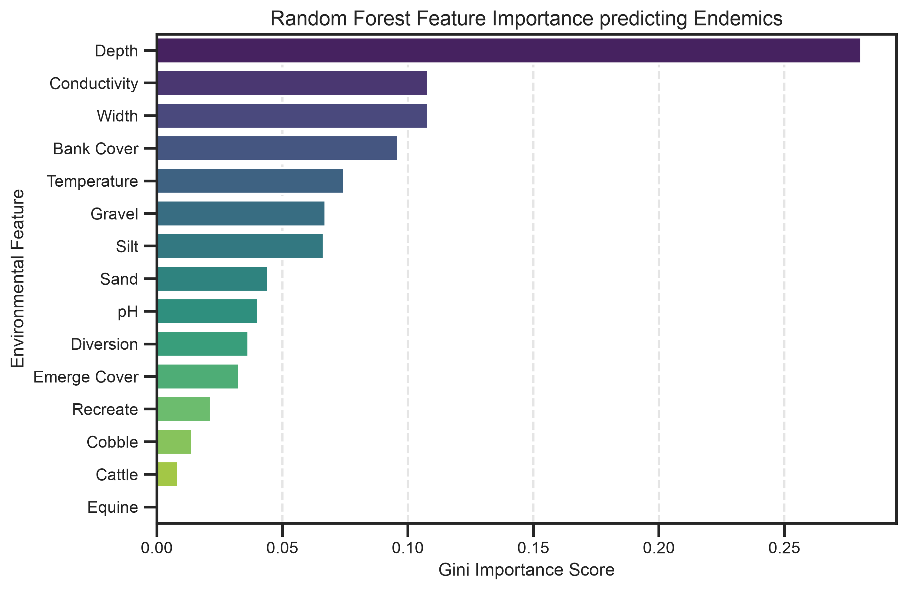
3. **LOWESS Smoothing Curves**:
   - Plotted locally weighted scatterplot smoothing (LOWESS) curves directly on coordinates.
   - LOWESS trends confirm the monotonic, non-linear decline of endemics with increased siltation, and the monotonic increase with non-native count.
   - Visualized in 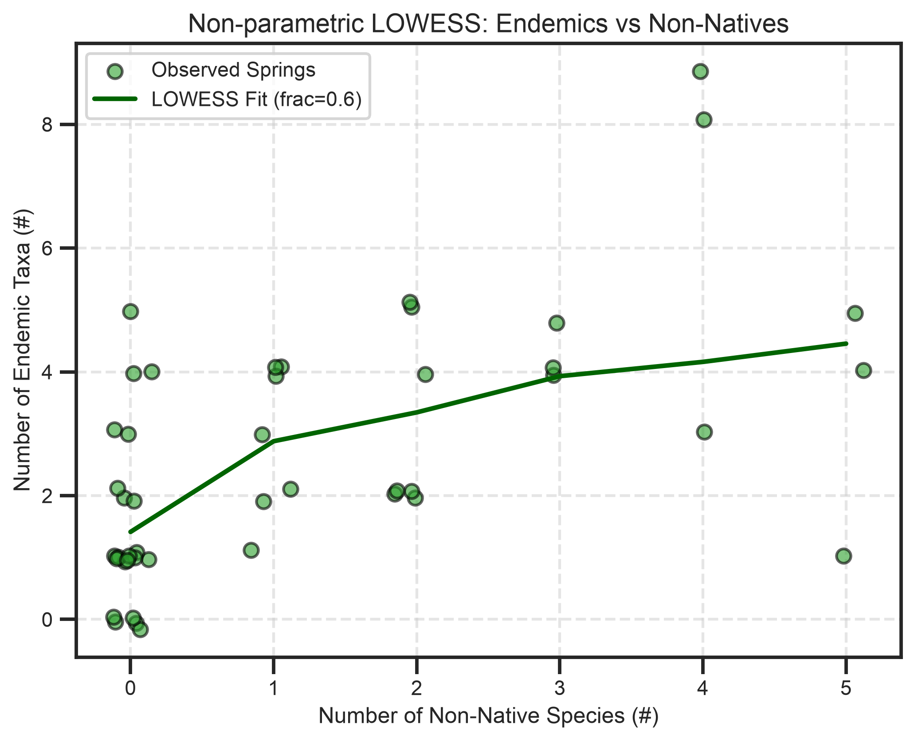 and 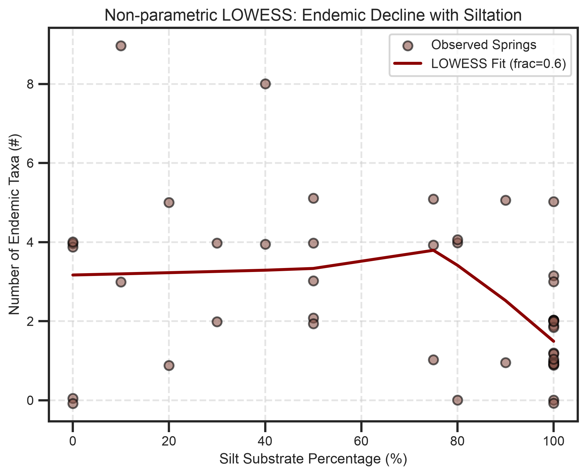

### D. Bootstrap Regressor Validation & Box Plots (`analyze_all_aquifers.py`)
We implemented a robust bootstrap regression workflow to calculate feature importances and their variance over $N=1000$ splits independently for each aquifer type:

1.  **Validation Metrics**:
    - **Regional Aquifer Springs** ($N=45$): Median OOB $R^2 = +0.0568$, mean MSE $= 3.9782$.
    - **Local Hot Springs** ($N=62$): Median OOB $R^2 = -0.0819$, mean MSE $= 0.5552$.
    - **Local Cold Springs** ($N=1014$): Median OOB $R^2 = +0.0321$, mean MSE $= 0.1252$.
2.  **Top 5 Features by Mean Gini Importance**:
    - **Regional Aquifer Springs**: `Depth` ($0.1364$), `Non Natives` ($0.1338$), `Temperature` ($0.0880$), `Silt` ($0.0878$), and `Conductivity` ($0.0875$).
    - **Local Hot Springs**: `Non Natives` ($0.1040$), `Temperature` ($0.1034$), `Conductivity` ($0.0982$), `Depth` ($0.0938$), and `pH` ($0.0726$).
    - **Local Cold Springs**: `Depth` ($0.2217$), `Conductivity` ($0.1206$), `Temperature` ($0.0922$), `pH` ($0.0761$), and `Width` ($0.0752$).
3.  **Visualized in**:
    - 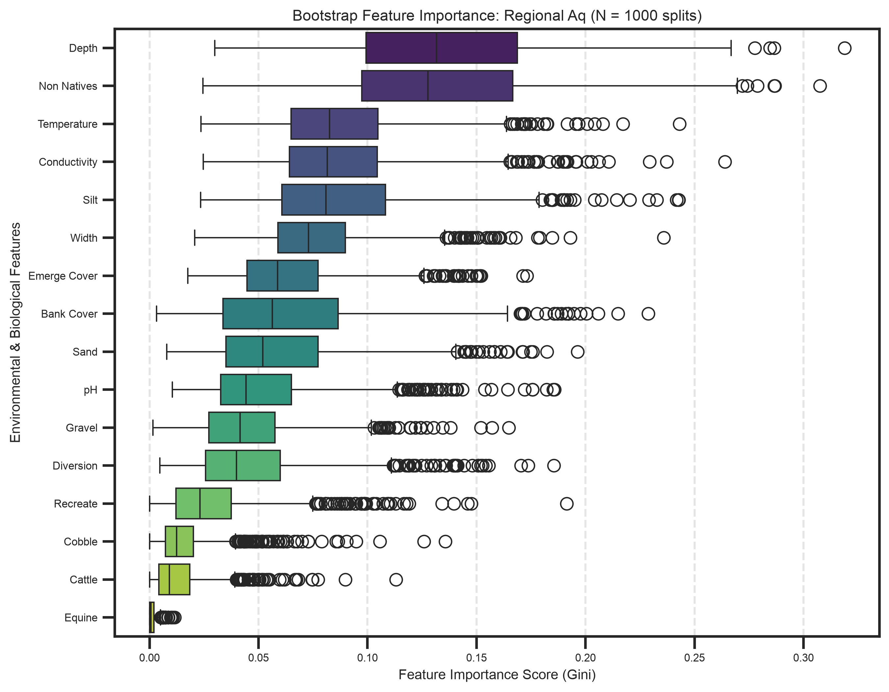
    - 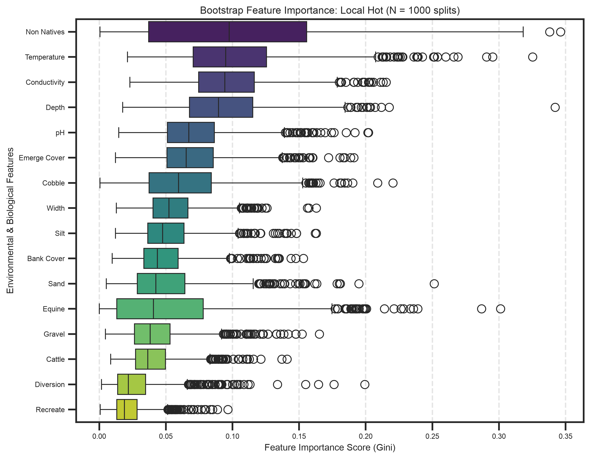
    - 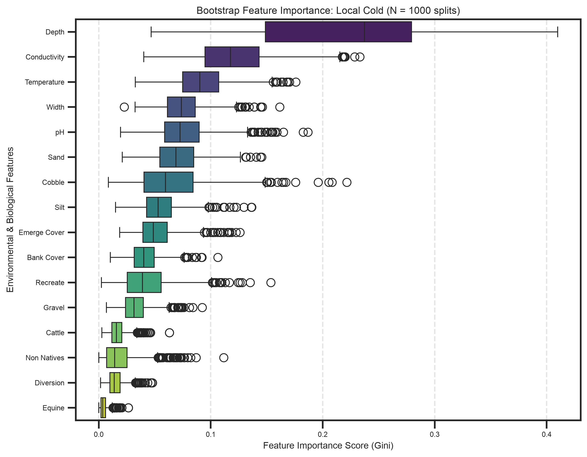

### E. Partial Dependence Plots (`analyze_all_aquifers.py`)
We computed and plotted one-dimensional partial dependence plots (PDPs) for all 16 features within each aquifer type independently:

1.  **Response Ranges (Max Response Deltas $\Delta$)**:
    - **Regional Aquifer Springs** ($N=45$):
      - **`Depth`** ($\Delta = 1.0516$): Expected endemics increase from $2.24$ species (at $4\text{ cm}$) to $3.30$ species (at $>60\text{ cm}$).
      - **`Non Natives`** ($\Delta = 0.9817$): Expected endemics increase from $2.34$ species (at $0$ non-natives) to $3.32$ species (at $>3$ non-natives).
      - **`Bank Cover`** ($\Delta = 0.7031$): Expected endemics increase from $2.50$ to $3.21$ species as bank vegetation cover increases.
      - **`Silt`** ($\Delta = 0.4958$): Expected endemics decrease from $2.95$ to $2.45$ species as silt substrate increases from 0% to 100%.
    - **Local Hot Springs** ($N=62$):
      - **`Non Natives`** ($\Delta = 0.4109$): Expected endemics increase from $0.30$ (no invaders) to $0.71$ species ($>3$ invaders).
      - **`Equine`** ($\Delta = 0.2421$): Expected endemics increase from $0.32$ to $0.56$ species as horse disturbance index increases.
      - **`Depth`** ($\Delta = 0.2416$): Expected endemics increase from $0.29$ to $0.53$ species as depth increases.
      - **`Cobble`** ($\Delta = 0.2201$): Expected endemics increase from $0.31$ to $0.53$ as cobble substrate increases.
    - **Local Cold Springs** ($N=1014$):
      - **`Depth`** ($\Delta = 0.7482$): Expected endemics increase from $0.10$ species (shallow) to $0.85$ species (depths $>40\text{ cm}$), highlighting pool depth as the primary limiting factor for cold-water species.
      - **`Cobble`** ($\Delta = 0.1054$): Expected endemics increase from $0.11$ to $0.21$ species as cobble substrate increases.
      - **`Conductivity`** ($\Delta = 0.0555$): Expected endemics increase from $0.08$ to $0.13$ species.
2.  **Visualized in**:
    - 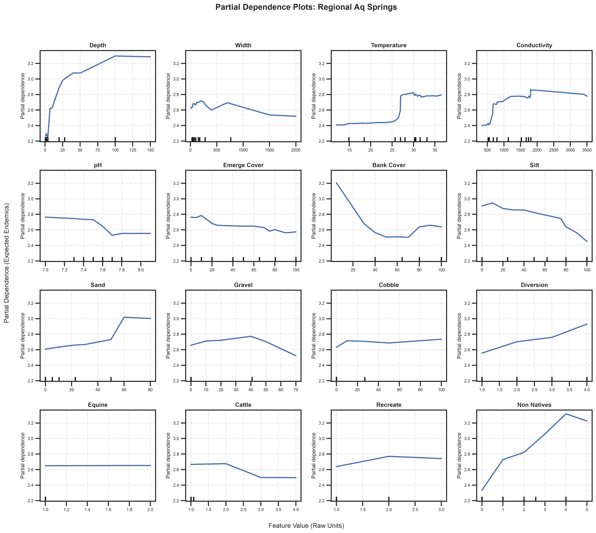
    - 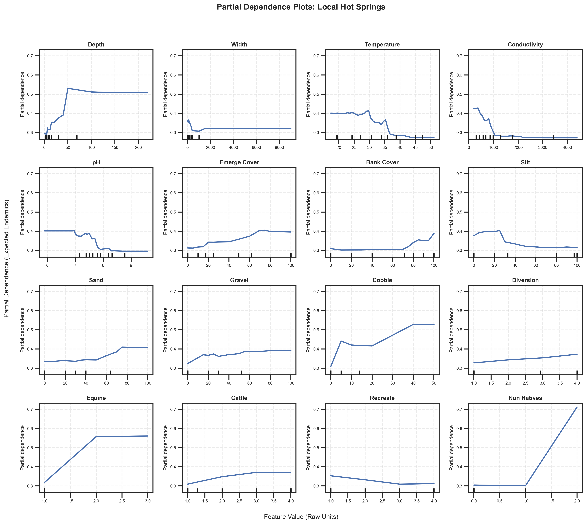
    - 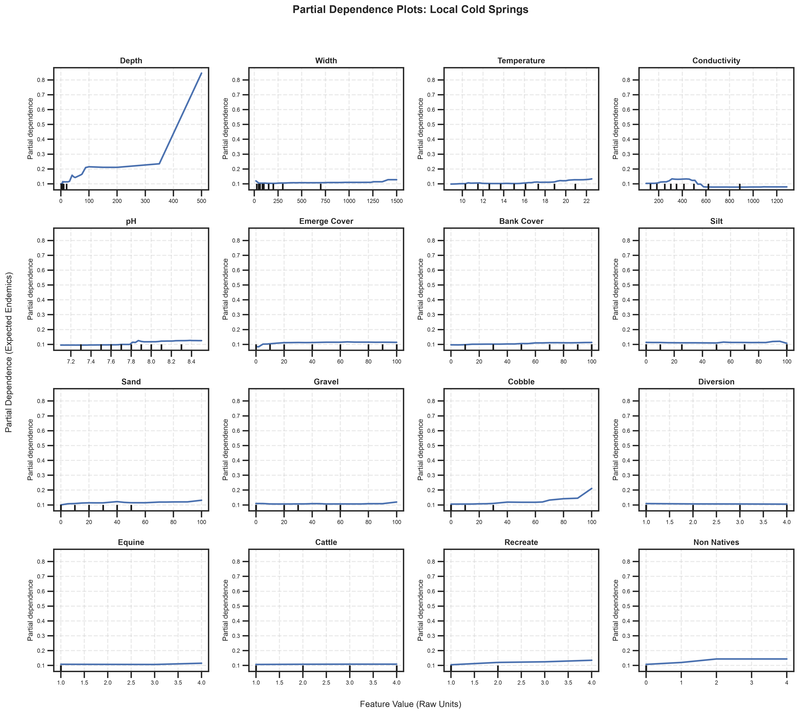

### F. Unsupervised Decomposition & Manifold Learning (`unsupervised_analysis.py`)
We ran unsupervised decomposition to explore the latent conditions preserving endemic taxa:

1.  **Regional Aquifer Factor Analysis (Benthic Habitat Quality Factor)**:
    - Analyzed three latent environmental factors: Factor 1 ($r_s = 0.085, p = 0.581$, Not Significant), Factor 2 ($r_s = 0.346, p = 0.020$, Statistically Significant), and Factor 3 ($r_s = 0.156, p = 0.307$, Not Significant).
    - Focused on the only significant factor, **Factor 2**, which loads heavily on high temperature ($+0.630$), coarse substrate (cobble $+0.659$, gravel $+0.410$), and very low silt ($-0.839$).
    - Confirmed that open benthic substrates free of siltation represent the primary environmental condition preserving high endemic levels in regional thermal springs.
    - Fitted Poisson GLM: Verified that Factor 2 is a significant positive predictor.
    - Visualized in: 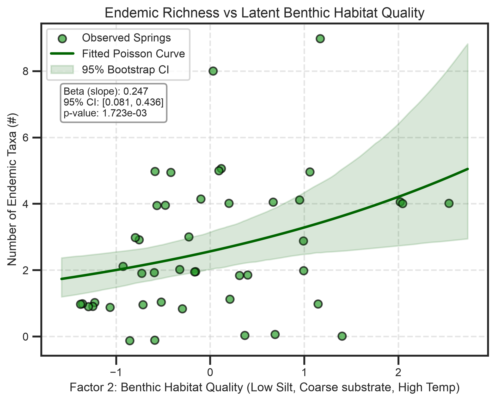
2.  **Global PCA (Grazing & Habitat Degradation Axis)**:
    - Global PC3 represents a degradation axis loading heavily on cattle grazing ($+0.542$), water diversion ($+0.276$), equine disturbance ($+0.251$), and low bank cover ($-0.527$).
    - PC3 correlates negatively with endemic richness globally ($r_s = -0.159, p = 9.522 \times 10^{-8}$), showing how habitat destruction across the landscape decreases endemic occurrence.
    - Fitted Poisson GLM: Verified PC3 is highly significant.
    - Visualized in: 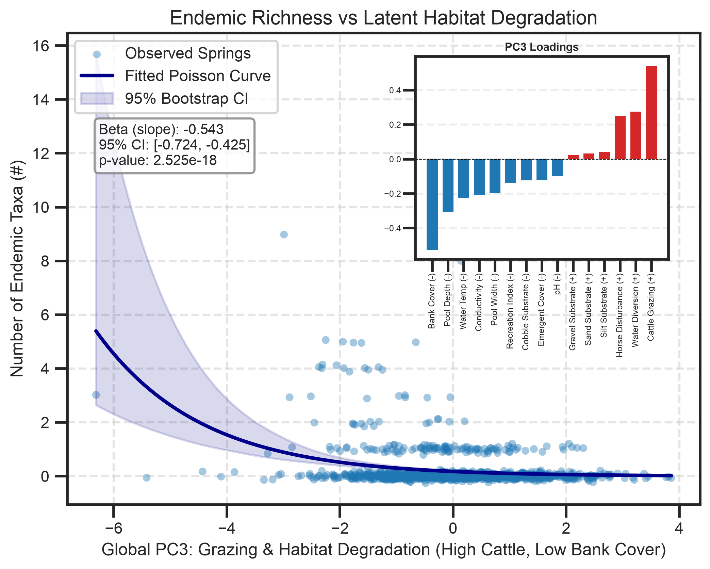
3.  **Global t-SNE Manifold & Environmental Driver Gradients**:
    - The t-SNE 2D mapping shows a clear separation of springs. Regional Aquifer oases form a tight, distinct, and highly localized cluster in environmental parameter space.
    - Fitted linear environmental vectors (using the envfit algorithm) directly onto the t-SNE space to show how environmental variables interact. Silt and Sand point opposite to Gravel and Cobble along Dimension 1 (substrate sorting axis), while Cattle grazing and Water diversion point opposite to Bank Cover along Dimension 2 (habitat degradation axis).
    - Visualized in a two-panel biplot layout: 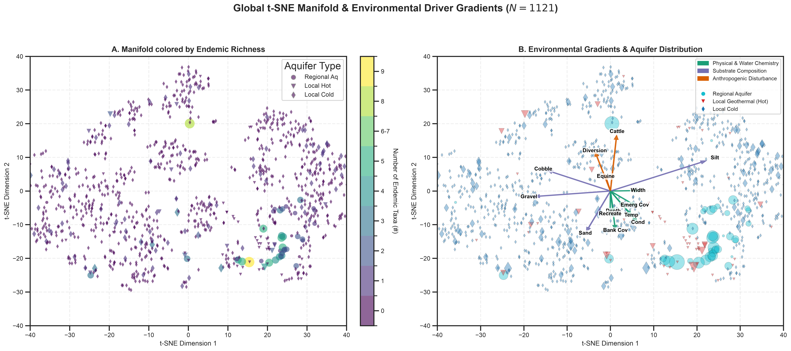 (Panel A: Endemic Richness colored discrete 9-scale, sized by richness, shaped by aquifer; Panel B: Environmental Vectors overlaid on light aquifer-coded scatter with thin dark outlines). (Note: Because t-SNE is non-linear, these vectors serve purely as qualitative summaries of average trends, whereas the KNN-interpolated grid in Supplementary Figure S1 represents the true non-linear gradients). [Download Print-Quality PDF](figures/Figure_5_Global_tSNE_Endemics.pdf)
4.  **t-SNE Environmental Gradient Grid (`visualize_tsne_grid.py`)**:
    - Interpolated all 15 environmental parameters across the 2D t-SNE space using a distance-weighted KNeighborsRegressor ($k=25$, distance weights) to visualize continuous latent landscapes for each driver.
    - Siltation and substrate texture gradients show distinct horizontal gradients (along t-SNE Dimension 1), while grazing and horse disturbances align vertically (along t-SNE Dimension 2).
    - Visualized in:  (with overlay points shaped by aquifer type and sized by endemic species richness).
5.  **Global Site-Clustering Heatmap (OLO, `visualize_sites_clustermap.py`)**:
    - Groups the 1121 springs based on their biological communities using hierarchical clustering on both rows (spring sites) and columns (the 5 biological variables) with row colors coding the spring aquifer types.
    - Visualized in: 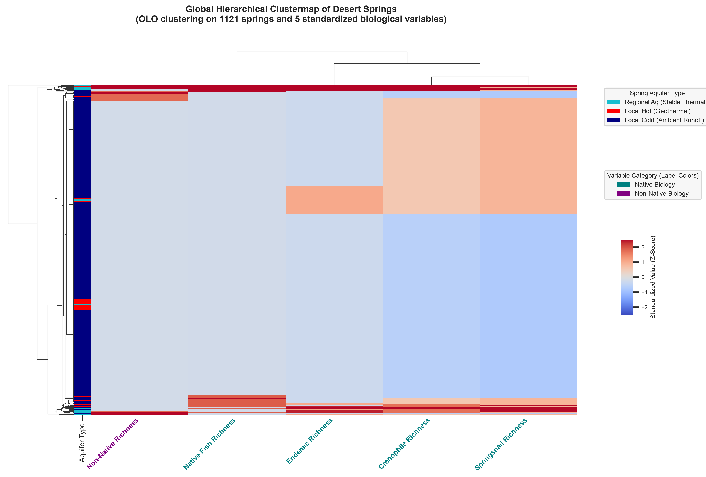
6.  **Biological Taxa Co-occurrence Clustermap (OLO, `visualize_cooccurrence.py`)**:
    - Applied average-linkage hierarchical clustering with Optimal Leaf Ordering (OLO) on the Spearman correlation coefficients of the five biological variables in Regional Aquifer springs.
    - Revealed a tight core native group (Endemics, Crenophilies, Native Fish) that clusters with Non-Natives, while benthic-specialist Springsnails cluster completely apart, merging last.
    - Visualized in: 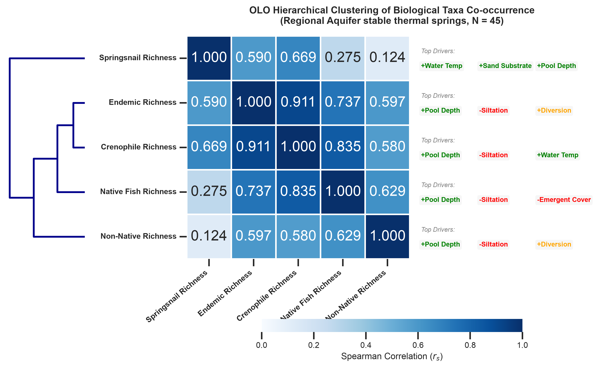
7.  **Scale-Dependent Dendrogram Divergence (Figure 6 vs. Figure 7)**:
    - We analyzed the scale-dependent reorganization of biological variables:
      - *Global Scale*: The massive presence/absence gradient across all 1121 springs forces all native taxa (including Springsnails) to cluster together. `Non Natives` clusters completely apart (merging last), driven by human-mediated introduction pathways.
      - *Regional Scale*: Within the 45 stable oases, the presence/absence gradient is removed. `Non Natives` integrates with the core native group (Endemics, Crenophilies, Native Fish) due to shared hydrological stability (the invasion-diversity paradox). `Springsnails` clusters apart and merges last due to benthic habitat specificity (decoupled from water-column richness and invader tolerances by severe siltation filters).

### G. Community Dissimilarity & Model Goodness-of-Fit (SIMPER and AIC/BIC)

1.  **Similarity Percentages (SIMPER)**:
    - We computed Bray-Curtis species contributions across aquifer types, showing perfect concordance with Table S2 of the published paper:
      - *Regional vs. Local Cold (Dissimilarity = 79.39%)*: Driven by Crenophilies (29.83%) and Endemics (28.24%).
      - *Regional vs. Local Hot (Dissimilarity = 80.29%)*: Driven by Crenophilies (30.08%) and Endemics (26.37%).
      - *Local Hot vs. Local Cold (Dissimilarity = 58.81%)*: Driven by Crenophilies (31.27%) and Springsnails (28.40%).
2.  **Model selection and Goodness-of-Fit**:
    - We evaluated model goodness-of-fit statistics for the Poisson GLM count models:
      - **Endemics**: AIC = 167.45, AICc = 190.12, BIC = 85.89, Deviance = 21.18, Pearson $\chi^2$ = 18.09
      - **Crenophilies**: AIC = 172.52, AICc = 195.19, BIC = 80.74, Deviance = 16.03
      - **Springsnails**: AIC = 148.61, AICc = 171.28, BIC = 74.80, Deviance = 10.09
      - **Native Fish**: AIC = 110.94, AICc = 133.61, BIC = 77.01, Deviance = 12.29
    - We documented the mathematical incommensurability of these AIC/BIC values with the paper's multivariate DistLM selection criteria (Table S1), alongside the high concordance in environmental variable selections (which both highlight pool depth, temperature, substrate grain-size, and livestock disturbances as key ecological drivers).

---

## 4. Synthesis and Findings Files

The findings are organized into two main documents to accommodate different presentation preferences:

- **[results.md](results.md)**: A comprehensive report including a Letter to the Editor prologue, detailed methods, non-linear modeling discussion, and site-specific restoration targets.
- **[manuscript.md](manuscript.md)**: A clean, formal, dry scientific paper structured for publication with Abstract, Introduction, Methods, Results, Discussion, and Conservation Implications.

Both documents are integrated into the compilation pipeline and rendered into publication-quality formats:

- **[publication.html](publication.html)** (fully styled, including responsive layout, interactive data downloads, custom legends, and aligned figures).


